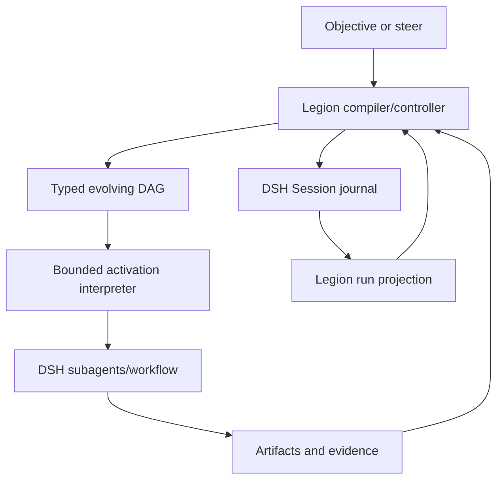

# dsh-legion v1.1.0 Implementation Plan

**Codename:** Journal-Native Evolving Workflows  
**Target release:** `1.1.0`  
**Document status:** Implementation directive  
**Date:** 2026-08-16  
**Intended audience:** An AI coding agent or human maintainer implementing the release  

This document is deliberately written in English because `dsh-legion` requires English code, comments, documentation, commit messages, and release notes.

Normative terms such as **MUST**, **MUST NOT**, **SHOULD**, and **MAY** are used intentionally.

---

## 1. Executive directive

Implement `dsh-legion` v1.1.0 as a **journal-native, typed, evolving orchestration controller** on top of DeepSeek Harness (DSH).

The release must add:

- durable Strategy Runs represented entirely by typed events in the existing DSH Session journal;
- a static and dynamically extensible DAG execution model;
- deterministic crash recovery from journal state;
- owner fingerprints, leases, monotonically increasing fencing tokens, and stale-result rejection;
- task-addressed durable mailbox semantics with reservation, incorporation, acknowledgement, expiry, and reclaim;
- a first-class `stair-step` advancement policy that repeatedly delivers the smallest visible, verifiable increment;
- ordered, immutable `ContextManifest`s inspired by arenas, generational memory, page tables, and working sets while preserving prefix-cache stability;
- bounded, one-shot, delimited continuations represented as data, not captured JavaScript stacks;
- environment snapshots and pre-start revalidation;
- multi-model execution through the existing Specialist and Route Plan architecture;
- hierarchical parallel patterns and context sharding inspired by Kimi Agent Swarm;
- replay and inspection projections optimized by the existing DSH projection cache.

The release must **not** add:

- another journal, WAL, database, task directory, mailbox directory, or state file owned by Legion;
- another Agent, Session, subagent, Goal, sandbox, approval, provider, or generic workflow runtime;
- arbitrary model-written JavaScript as the durable control representation;
- raw `call/cc`, captured closures, resumable VM stacks, or multi-shot continuations;
- unbounded graph mutation, unbounded retries, unbounded fan-out, or silent authority expansion;
- a token-intensive live-model scale campaign. Large-scale throughput certification is intentionally deferred from this plan.

The central architectural statement is:

> DSH owns physical execution and durability. Legion owns typed orchestration meaning, compilation, projections, and bounded decisions.

---

## 2. Why this release exists

### 2.1 Current v1.0.0 baseline

`dsh-legion` v1.0.0 already provides a strong static foundation:

- customization-first Specialists, Cohorts, and Strategies;
- exact pre-start Route Plans with multiple model/provider candidates;
- type-driven authored, effective, and compiled representations;
- artifact wiring and bounded `delegate`, `fanout`, and `synthesize` stages;
- immutable execution snapshots and generation fencing;
- real DSH one-shot and continuable subagents;
- cancellation, settlement, output bounds, and closed outcomes;
- public defaults-as-data with no hidden privileges.

However, its Strategy executor walks a frozen plan inside one live invocation. It is intentionally not a durable scheduler. It cannot reconstruct an interrupted Strategy Run, change the plan based on evidence, durably reserve messages, or yield and resume at a semantic boundary.

### 2.2 The architectural gap

The useful maximum of OMO and Kimi Agent Swarm is not one feature. It is the combination of:

- OMO-like coordination correctness: dependencies, atomic ownership, recovery, mailbox delivery state, and stale cleanup;
- Kimi-like orchestration quality: wide parallel decomposition, hierarchical reduction, context sharding, real-parallelism measurement, and long-horizon adaptation;
- Legion's existing advantages: multiple models/providers, semantic Specialists, typed compilation, explainable exact routes, customization-first contracts, and DSH-native lifecycle ownership.

v1.1.0 should combine these without copying their storage layout or creating a second runtime.

### 2.3 What “better” means in v1.1.0

For this release, “better” means a stronger architecture and correctness envelope:

- one canonical DSH journal instead of parallel task/mailbox/state stores;
- typed and hygienic dynamic plan changes instead of unconstrained orchestration text or code;
- ordered context manifests designed for cache reuse;
- heterogeneous model routing from the beginning;
- explicit fencing and stale-result rejection;
- recovery by deterministic replay rather than process-memory reconstruction;
- bounded activations that can yield, resume, and revise goals.

It does **not** mean that v1.1.0 may claim empirically higher throughput or quality than Kimi Agent Swarm without later live-model evidence. Do not make an unverified marketing claim.

---

## 3. Required change to repository architecture instructions

The current repository instructions and roadmap state that a Legion scheduler, mailbox, live Cohort runtime, and task store are non-goals. The human owner has now authorized a narrower replacement rule.

The first implementation change MUST update `AGENTS.md`, `CONTEXT.md`, `docs/roadmap.md`, and the relevant ADRs to say:

1. DSH remains the sole owner of Agent, Session, subagent, workflow, Goal, persistence, sandbox, approval, model adapter, and UI lifecycles.
2. Legion may own a **domain-specific durable orchestration controller** that:
   - compiles and interprets Legion's typed DAG IR;
   - records all durable facts as plugin-owned Session events;
   - derives state through DSH Session projections;
   - delegates all child execution to DSH;
   - uses Host-owned atomic coordination and admission capabilities.
3. Legion still MUST NOT create a generic scheduler service, independent task database, second mailbox queue, second WAL, or process-global runtime.
4. The existing ephemeral v1.0 Strategy path remains supported and unchanged by default.

This distinction is load-bearing. The new controller is an interpreter for one bounded domain IR, not a replacement for DSH workflow or subagent infrastructure.

Create these ADRs before runtime code:

- `0015-journal-native-durable-strategy-runs.md`
- `0016-evolving-dag-and-validated-plan-deltas.md`
- `0017-run-leases-fencing-and-mailbox-delivery.md`
- `0018-ordered-context-manifests-and-cache-stable-arenas.md`
- `0019-stair-step-and-delimited-continuations.md`
- `0020-host-coordination-and-admission-authority.md`

Each ADR must include context, decision, invariants, rejected alternatives, compatibility, failure semantics, and consequences.

---

## 4. Product goals and non-goals

### 4.1 Goals

v1.1.0 is complete only when it can:

1. Start an opt-in durable Strategy Run anchored to the invoking DSH Session.
2. Persist a typed run, plan, task, attempt, mailbox, milestone, and continuation history through DSH Session events.
3. Derive the complete current orchestration state using a pure DSH Session projection.
4. Execute independent ready DAG nodes concurrently within compiled and Host admission limits.
5. Accept a validated `PlanDelta` that extends or supersedes pending work without rewriting committed history.
6. Stop at a durable semantic boundary, return a continuation handle, and later resume without capturing process state.
7. Recover incomplete runs after a process crash and reject results from expired owners or earlier generations.
8. Route every attempt through an immutable Specialist and exact Route Plan.
9. Build deterministic, ordered context manifests whose common prefixes remain byte-stable across sibling tasks where possible.
10. Deliver and reclaim task-addressed messages with at-least-once delivery and idempotent incorporation.
11. Implement `stair-step` as a public, replaceable policy contract rather than a privileged built-in strategy name.
12. Explain and replay a run without scanning child model histories into the coordinator context.

### 4.2 Non-goals

The following are explicitly outside v1.1.0:

- multi-host distributed scheduling without a Host-provided atomic coordination capability;
- exactly-once external side effects;
- arbitrary peer-to-peer agent chat;
- arbitrary code callbacks in Strategy specifications;
- a general-purpose durable JavaScript workflow engine;
- automatic compensation/Saga generation for non-idempotent tools;
- provider credential, quota, billing, or health ownership;
- a new binary artifact store;
- automatic migration of a durable run to another parent Session;
- automatic large-scale live-model certification;
- a GUI control surface beyond projection data and existing DSH extension seams.

### 4.3 Correctness claims

The implementation may claim:

- **at-least-once task execution** under crash recovery;
- **exactly-once accepted commit** for a logical attempt result, enforced by task generation and fencing;
- **no automatic replay of ambiguous non-idempotent effects**;
- **deterministic state reconstruction** from a valid DSH journal plus registered projection definition.

It MUST NOT claim exactly-once external execution. That is impossible without cooperation from the external system or an idempotency key accepted by the tool.

---

## 5. Target architecture



### 5.1 Macro plane

The macro plane is the durable, evolving DAG:

- authoritative plan state is journaled;
- task and attempt state is journaled;
- plan changes are validated and versioned;
- activations are bounded and resumable;
- milestones and continuation tokens are durable.

### 5.2 Micro plane

The micro plane executes one ready node:

- ordinary nodes use existing DSH subagent providers through frozen Legion Specialists;
- fan-out remains bounded and settles through DSH child lifecycle APIs;
- an optional DSH workflow adapter may execute pure/read-only high-throughput micro-swarms only when it preserves Specialist authority and result contracts;
- micro-plane process state is disposable; only committed results matter.

### 5.3 Root and child journals

- The invoking/root Session is the aggregate journal for the Strategy Run.
- Child Sessions retain their native model/tool history under DSH ownership.
- The root journal stores child references and bounded result envelopes, never copied child transcripts.
- Every cross-reference uses stable `runId`, `taskId`, `attemptId`, `generation`, and `childSessionId` values.

---

## 6. Ownership matrix

| Concern | Owner | Reason |
| --- | --- | --- |
| Physical append-only journal and persistence | DSH | It is already the canonical Session source of truth. |
| Flush/durability barrier | DSH `ctx.sessions.flush()` | Avoid a second WAL and preserve backend independence. |
| Projection registry and persisted projection cache | DSH | Cold replay already supports checkpoint + tail folding. |
| Agent, tool, subagent, cancellation, approval, sandbox | DSH | Legion must not fork lifecycle authority. |
| Specialists, Cohorts, Strategies, typed DAG, PlanDelta | Legion | These are Legion's semantic domain. |
| Run/task/attempt state machines | Legion | They define orchestration meaning, not physical execution. |
| Atomic run claim and fencing | Host/DSH coordination seam | Journal append alone cannot exclude concurrent owners. |
| Global resource admission | Host/DSH admission seam | Separate Legion calls cannot safely self-coordinate globally. |
| Mailbox protocol | Legion semantics over DSH journal | No second queue or mailbox directory. |
| ContextManifest ordering and selection | Legion | It is Strategy/Specialist-aware prompt composition policy. |
| Artifact bytes | Existing DSH/workspace facilities | v1.1.0 must not introduce another blob store. |
| Replay/explain view | Legion projection/API | The view is domain-specific and derived. |

---

## 7. Compatibility and opt-in strategy

v1.1.0 is a SemVer minor release. Existing behavior must remain compatible.

### 7.1 Keep config version 2

Do not bump `configVersion` merely for additive optional fields. Existing unversioned/v1 migration and v2 documents must continue to compile identically.

Add only optional v2 fields with defaults that preserve v1.0 behavior:

```ts
interface LegionConfigV2 {
  // existing fields...
  readonly enableDurableRuns?: boolean        // default false
  readonly durableRunPolicy?: DurableRunPolicySpec
}
```

`enableDurableRuns: false` means:

- the new model-facing run-control branch is absent;
- existing direct Specialist and ephemeral Strategy branches are unchanged;
- no durable controller effects are registered beyond harmless projection capability if configured.

### 7.2 Preserve the existing Strategy call

The existing Strategy invocation remains ephemeral unless the caller explicitly requests durable execution and deployment policy allows it:

```ts
{
  kind: "strategy",
  strategy: "reviewed-implementation",
  objective: "...",
  execution?: {
    durability?: "ephemeral" | "journal",
    advancement?: "continuous" | "checkpoint"
  }
}
```

Omission must preserve v1.0 semantics.

### 7.3 Add one run-control branch

Use one bounded discriminated branch rather than several new tools:

```ts
type RunControlInput = {
  readonly kind: "run"
  readonly action: "inspect" | "resume" | "steer" | "cancel"
  readonly runId: RunId
  readonly continuation?: ContinuationToken
  readonly message?: string
}
```

Rules:

- `inspect` is read-only and bounded.
- `resume` consumes one valid continuation or recovers an incomplete activation.
- `steer` appends a user-authorized goal revision proposal; it does not mutate the plan directly.
- `cancel` records intent, cancels current DSH children through existing authority, settles, flushes, and returns.

### 7.4 Event schema versioning

Event payloads use an independent `schemaVersion: 1`. Changing event interpretation requires a new schema version and explicit fold compatibility; it is not coupled to `configVersion` or package version.

---

## 8. Type system and programming-language design rules

Use TypeScript as a design tool, but do not emulate a research language unnecessarily.

### 8.1 Branded identities

Introduce distinct branded identities:

```ts
type RunId = Brand<string, "LegionRunId">
type PlanVersion = Brand<number, "LegionPlanVersion">
type TaskId = Brand<string, "LegionTaskId">
type AttemptId = Brand<string, "LegionAttemptId">
type MailId = Brand<string, "LegionMailId">
type ContinuationId = Brand<string, "LegionContinuationId">
type Fence = Brand<number, "LegionFence">
type ArtifactDigest = Brand<string, "ArtifactDigest">
type ContextDigest = Brand<string, "ContextDigest">
```

Never interchange IDs through casts in implementation code. Parse and construct them at trusted boundaries.

### 8.2 Separate authored, validated, compiled, and runtime states

Maintain distinct representations:

```text
Authored spec
  -> runtime-schema validated spec
  -> materialized effective catalog
  -> compiled immutable graph
  -> journaled plan version
  -> projected runtime state
```

No downstream phase may accept an earlier representation by convenience.

### 8.3 Algebraic data types

Use discriminated unions for:

- node operations;
- task, attempt, mailbox, run, and continuation states;
- recovery decisions;
- PlanDelta operations;
- execution effects and outcomes.

Every closed internal union must be exhaustively matched. DSH `SessionEvent` itself remains merge-extensible, so projection code must use a default branch that returns the same state reference.

### 8.4 Pure core, effectful shell

The following must be pure synchronous functions:

- graph compilation and validation;
- PlanDelta validation and application;
- event projection/reduction;
- ready-frontier calculation;
- recovery planning;
- context ordering and digest calculation;
- state-transition validation;
- milestone/no-progress evaluation.

The following are effects handled at the boundary:

- Session append and flush;
- lease acquisition/renewal/release;
- Host admission;
- DSH child start/cancel/dispose;
- artifact materialization;
- wall-clock reads and random ID generation.

Pass clocks, ID factories, and capabilities explicitly. Do not read globals in the pure core.

### 8.5 Hygienic macro expansion

`stair-step` and future declarative policy macros must expand hygienically:

- generated IDs use a reserved namespace such as `@legion/<macro>/<expansion-path>`;
- authored IDs are forbidden from entering the reserved namespace;
- generated artifact names are lexically scoped to the expansion;
- references are resolved before lowering;
- collisions fail compilation rather than being renamed silently;
- the expansion result passes through the same public graph validator as handwritten data.

This imports the useful property of hygienic macro systems—no accidental name capture—without embedding a macro language.

### 8.6 Avoid fake higher-kinded abstractions

TypeScript does not have native higher-kinded types. Do not add complex encoding libraries merely to imitate them. Use small generic interfaces where they make illegal states unrepresentable, and ordinary discriminated unions elsewhere.

---

## 9. Core domain model

### 9.1 Run

```ts
interface DurableRunRecord {
  readonly schemaVersion: 1
  readonly runId: RunId
  readonly anchorSessionId: string
  readonly strategyName: string
  readonly strategyPlanDigest: string
  readonly catalogDigest: string
  readonly status:
    | "created"
    | "active"
    | "suspended"
    | "completed"
    | "degraded"
    | "cancelled"
    | "failed"
    | "needs-attention"
  readonly goal: GoalSpec
  readonly goalVersion: number
  readonly currentPlanVersion: PlanVersion
  readonly currentMilestone: number
  readonly createdAt: number
  readonly updatedAt: number
  readonly terminal?: RunTerminalRecord
}
```

### 9.2 Goal

```ts
interface GoalSpec {
  readonly statement: string
  readonly acceptance: readonly AcceptanceCriterion[]
  readonly constraints: readonly string[]
  readonly nonGoals: readonly string[]
  readonly authorityDigest: string
}
```

A vague goal is allowed, but it is versioned. Evidence may produce a `GoalRevisionProposal`; only an authorized controller transition commits `goalVersion + 1`. Old goal versions remain in history.

### 9.3 Plan graph

```ts
interface PlanGraph {
  readonly planVersion: PlanVersion
  readonly basePlanVersion?: PlanVersion
  readonly goalVersion: number
  readonly nodes: Readonly<Record<TaskId, TaskSpec>>
  readonly edges: readonly PlanEdge[]
  readonly completion: CompletionSpec
  readonly limits: EffectiveRunLimits
  readonly environmentDigest: string
  readonly digest: string
}
```

### 9.4 Task specification

Keep the executable kernel smaller than the public Strategy vocabulary:

```ts
type TaskOp =
  | InvokeOp
  | JoinOp
  | BranchOp
  | SuspendOp

interface TaskSpecBase {
  readonly taskId: TaskId
  readonly label: string
  readonly inputs: readonly ArtifactInputRef[]
  readonly outputs: readonly ArtifactOutputSpec[]
  readonly effectClass: "read" | "idempotent-write" | "non-idempotent-write"
  readonly retryPolicy: RetryPolicy
  readonly contextPolicy?: ContextPolicyRef
}
```

Existing `delegate`, `fanout`, and `synthesize` stages lower to one or more `InvokeOp`s plus dependency edges. `JoinOp`, `BranchOp`, and `SuspendOp` remain host-interpreted control operations and never start an Agent by themselves.

### 9.5 Task state

```ts
type TaskStatus =
  | "pending"
  | "ready"
  | "leased"
  | "running"
  | "suspended"
  | "succeeded"
  | "failed"
  | "cancelled"
  | "superseded"
  | "blocked"

interface TaskRecord {
  readonly taskId: TaskId
  readonly planVersion: PlanVersion
  readonly generation: number
  readonly status: TaskStatus
  readonly currentAttempt?: AttemptId
  readonly acceptedArtifacts: readonly ArtifactRef[]
  readonly failure?: FailureRecord
  readonly updatedAt: number
}
```

### 9.6 Attempt

```ts
interface AttemptRecord {
  readonly attemptId: AttemptId
  readonly taskId: TaskId
  readonly generation: number
  readonly owner: OwnerFingerprint
  readonly fence: Fence
  readonly specialist: string
  readonly routePlanDigest: string
  readonly environmentDigest: string
  readonly contextManifestDigest: ContextDigest
  readonly status: "prepared" | "started" | "settled" | "abandoned" | "rejected-stale"
  readonly childSessionIds: readonly string[]
  readonly startedAt?: number
  readonly settledAt?: number
  readonly result?: ResultEnvelope
}
```

### 9.7 Artifact reference

v1.1.0 does not create a blob store. Use bounded immutable references:

```ts
type ArtifactRef =
  | {
      readonly kind: "inline"
      readonly digest: ArtifactDigest
      readonly contract: ArtifactContract
      readonly mediaType: string
      readonly bytes: number
      readonly value: JsonValue
    }
  | {
      readonly kind: "session-event"
      readonly digest: ArtifactDigest
      readonly contract: ArtifactContract
      readonly sessionId: string
      readonly seq: number
    }
  | {
      readonly kind: "workspace-file"
      readonly digest: ArtifactDigest
      readonly contract: ArtifactContract
      readonly relativePath: string
      readonly bytes: number
    }
```

Workspace-file references must be confined, relative, and digest-verified on every materialization. Mutable paths without a verified digest are not artifacts.

### 9.8 Result envelope

```ts
interface ResultEnvelope {
  readonly schemaVersion: 1
  readonly taskId: TaskId
  readonly attemptId: AttemptId
  readonly generation: number
  readonly fence: Fence
  readonly summary: string
  readonly artifacts: readonly ArtifactRef[]
  readonly evidence: readonly EvidenceRef[]
  readonly decisions: readonly DecisionRecord[]
  readonly verification: readonly VerificationRecord[]
  readonly openRisks: readonly string[]
  readonly progress: ProgressEvidence
}
```

The controller commits only this bounded envelope. It does not copy the child transcript.

---

## 10. DSH journal integration

### 10.1 Single source of truth

Use DSH `SessionEventMap` declaration merging. Do not create a Legion journal abstraction that can persist independently.

The root Session is authoritative for the run. Every persisted orchestration fact must be represented as a plugin-owned, JSON-lossless, log-only event.

### 10.2 Event family

Prefer complete post-state records for bounded aggregates so projection transitions are cheap and crash cuts are understandable:

```ts
interface LegionEventHeader {
  readonly schemaVersion: 1
  readonly runId: RunId
  readonly planVersion: PlanVersion
  readonly entityId?: string
  readonly taskId?: TaskId
  readonly attemptId?: AttemptId
  readonly generation?: number
  readonly fence?: Fence
  readonly causationSeq?: number
  readonly correlationId: string
  readonly phase?: string
}

declare module "@deepseek-ai/dsh-session" {
  interface SessionEventMap {
    "legion/run-state": LegionRunStateEvent
    "legion/plan-state": LegionPlanStateEvent
    "legion/task-state": LegionTaskStateEvent
    "legion/attempt-state": LegionAttemptStateEvent
    "legion/mail-state": LegionMailStateEvent
    "legion/milestone": LegionMilestoneEvent
    "legion/decision": LegionDecisionEvent
    "legion/continuation-state": LegionContinuationStateEvent
  }
}
```

Use exact module names exported by the installed DSH version; verify them before coding.

### 10.3 Structured journal markers

Do not add free-form tags. Review and replay markers are typed fields in the event payload:

- `phase`
- `taskId`
- `attemptId`
- `planVersion`
- `generation`
- `correlationId`
- artifact/decision digests

Milestone and decision events act as semantic anchors. The projection records their sequence numbers in a compact review index.

Do not rely on `SessionEvent.ignorable` unless the public DSH append API gains an explicit supported way to set it for plugin events. Current code should treat Legion events as required for run reconstruction.

### 10.4 Event append discipline

- Only the active controller activation may append coordination events for a run.
- Child Agents never append directly to the root run journal.
- Child outputs return through DSH result/report paths and are validated before root append.
- Event payloads are detached, plain lossless JSON.
- Never embed capabilities, `Agent`, handles, AbortSignals, class instances, Maps, Sets, Dates, functions, or absolute developer paths.
- The event-family invariant module validates Legion-specific transitions.

### 10.5 Durability barriers

Append events freely inside one local transition, but call `ctx.sessions.flush(session)` at these semantic barriers:

1. after run creation and successful run-lease acquisition, before starting any child;
2. after committing a new plan version, before admitting newly introduced tasks;
3. after recording prepared attempts for a dispatch batch, before executing non-idempotent work;
4. after accepting result envelopes and mailbox incorporation/ack state that will be exposed to later work;
5. after accepting a milestone;
6. after writing a suspension continuation, before returning it;
7. before returning any terminal run outcome;
8. best-effort during activation cleanup.

For read-only fan-out, multiple prepared attempts may share one flush barrier. Do not flush every heartbeat or every progress observation.

### 10.6 Three checkpoint meanings

Keep these concepts separate in names and code:

| Term | Mechanism | Authority |
| --- | --- | --- |
| Durability barrier | `ctx.sessions.flush()` | Required before external progression |
| Projection checkpoint | DSH session projection cache | Disposable accelerator |
| Milestone checkpoint | `legion/milestone` event | Semantic product progress |

Never call a Legion-owned state file a checkpoint.

---

## 11. Session projection and replay

### 11.1 Projection definition

Register exactly one primary projection key, for example `legion-run`, through `ctx.sessionProjections`:

```ts
declare module "@deepseek-ai/dsh-session-projection" {
  interface SessionProjectionMap {
    "legion-run": LegionRunProjectionView
  }
}
```

The definition must implement pure synchronous:

```ts
init(): LegionProjectionState
apply(state, event): LegionProjectionState
view(state): LegionRunProjectionView
stateVersion: number
```

Return the same state reference for non-Legion events and for Legion events that do not change the view.

### 11.2 Projection contents

The internal projection state should contain:

- all run records keyed by `runId` for the anchor Session;
- current full PlanGraph per run;
- compact TaskRecord and AttemptRecord maps;
- mailbox delivery states;
- active/consumed continuations;
- artifact metadata, never large payload duplication;
- review index: milestone, decision, failure, recovery, and plan-change seq numbers;
- derived ready frontier;
- bounded metrics summary.

The public view should be bounded and detached. Large run inspection must support filters rather than returning unbounded maps to a model.

### 11.3 Projection cache

Use the existing DSH projection cache. Do not implement Legion snapshots.

The expected cold path is:

```text
projection checkpoint
  + journal tail from restore floor
  -> pure fold
  -> current projection
```

Bump `stateVersion` whenever serialized projection state or fold semantics change. Add a test proving that mismatched versions refold safely.

After a milestone, suspension, or terminal durability flush, the controller MAY request an immediate `ctx.sessionProjectionCache.write(session)` when that optional service is available. Contain and diagnose a cache-write failure; it must never invalidate the authoritative journal commit. This makes milestone-oriented cold inspection fast without turning the cache into correctness state.

### 11.4 Replay APIs

Provide pure APIs:

```ts
projectLegionRun(events, runId): LegionRunProjectionView
explainLegionRun(view, filter): LegionRunExplainView
planRecovery(view, now, environment): RecoveryPlan
```

Add offline CLI support that consumes an explicitly exported event stream; it must not bypass DSH by reading backend-private files:

```text
dsh-legion replay --input session-events.jsonl --run <run-id> [--json]
```

Filters should include:

- plan version;
- task;
- attempt;
- milestone;
- failures/recovery only;
- decisions only.

---

## 12. Static DAG compilation

### 12.1 Preserve authored compatibility

Existing ordered Strategy stages remain valid. Their artifact inputs already imply data dependencies.

Add an optional control-only dependency field:

```ts
interface StageBase {
  // existing fields...
  readonly after?: readonly string[]
}
```

The compiler derives edges from:

- required artifact producer -> consumer;
- explicit `after` stage -> current stage;
- macro-generated control flow.

### 12.2 Graph validation

Compilation must reject:

- cycles, including cycles introduced only through `after`;
- missing or duplicate IDs;
- forward references that cannot be resolved after whole-graph collection;
- output artifact collisions;
- contract mismatches;
- impossible completion artifacts;
- nodes exceeding Cohort member/cardinality constraints;
- nodes that widen Specialist tools, model authority, depth, or deployment limits;
- generated/authored namespace capture;
- graph limits outside safe integer ranges.

### 12.3 Canonical graph digest

Digest the canonical graph, not authored object insertion order:

1. normalize defaults;
2. sort nodes by stable TaskId;
3. sort edges by `(from, to, reason)`;
4. canonicalize JSON;
5. hash with SHA-256.

The digest must include:

- strategy and catalog generation;
- effective limits;
- member/Specialist bindings;
- artifact contracts;
- effect class and retry policy;
- environment assumptions that affect validity.

It must not include wall-clock times, random run IDs, owner fingerprints, or live availability observations.

### 12.4 Ready frontier

`deriveReadyFrontier(plan, tasks, artifacts)` is pure and deterministic.

A task is ready only when:

- it belongs to the current plan or remains valid from a prior plan;
- it is pending;
- all hard dependencies succeeded;
- every required input artifact exists and matches its contract;
- no upstream failure blocks it;
- its branch predicate, if any, has resolved true;
- run and task limits permit another attempt.

Tie-break ready tasks by canonical TaskId. Runtime admission may delay them but may not reorder committed semantic results.

---

## 13. Dynamic DAG and PlanDelta

### 13.1 Why PlanDelta exists

A fully static DAG cannot adapt to new evidence. Arbitrary model-written code is flexible but cannot be safely replayed or validated. `PlanDelta` is the narrow middle path: the model proposes data; Legion validates, compiles, and commits it.

### 13.2 PlanDelta contract

```ts
interface PlanDeltaProposal {
  readonly schemaVersion: 1
  readonly basePlanVersion: PlanVersion
  readonly reason: string
  readonly evidence: readonly EvidenceRef[]
  readonly goalRevision?: GoalRevisionProposal
  readonly addNodes: readonly AuthoredDynamicTask[]
  readonly addEdges: readonly AuthoredPlanEdge[]
  readonly supersedePending: readonly TaskId[]
  readonly completion?: CompletionSpec
}
```

The committed event carries:

- the validated proposal or its digest;
- the complete resulting PlanGraph;
- the new plan version;
- validation/decision evidence;
- the controller Specialist and Route Plan digest that proposed it.

### 13.3 Monotonic graph evolution

A PlanDelta may:

- add bounded new nodes and edges;
- refine pending work into more specific pending work;
- supersede pending/ready tasks;
- change completion criteria only within original authority and limits;
- revise the goal when explicitly allowed by the run policy.

It may not:

- delete or rewrite completed task history;
- mutate an accepted artifact;
- change a running attempt's Specialist or route;
- reactivate a cancelled or superseded generation;
- remove evidence of failure;
- widen tools, permissions, depth, budget, deadline, output, node, attempt, or milestone limits;
- introduce a cycle;
- commit against a stale `basePlanVersion`.

### 13.4 Dynamic IDs and hygiene

The host, not the model, assigns final TaskIds. Model-proposed local names are scoped under the delta ID. All artifact references are resolved within that scope before global IDs are generated.

Example:

```text
model local id: investigate-cache
delta id: delta-0003
final id: @legion/delta-0003/investigate-cache
```

### 13.5 Decision production

Do not parse a PlanDelta from arbitrary prose. A planner/reviewer member must use a versioned structured result contract such as `plan-delta-v1`. If the selected provider cannot enforce and return structured output, dynamic plan mutation is unavailable for that attempt and must fail with a stable diagnostic.

The model never appends a plan event directly. It returns a proposal; the host validator owns the decision to commit or reject it.

---

## 14. Bounded activation interpreter

### 14.1 Why activations are bounded

Long-lived process-resident schedulers are difficult to recover and tend to accumulate memory, stale handles, and hidden state. A durable run should instead progress through bounded activations.

An activation:

1. acquires the run lease and fence;
2. reads the current projection;
3. performs recovery/reconciliation;
4. advances a bounded amount of ready work;
5. commits results, decisions, and milestones;
6. either terminates or writes a continuation and yields;
7. releases or lets the lease expire safely.

### 14.2 Activation bounds

Add deployer-owned and invocation-narrowable limits:

```ts
interface DurableRunLimits extends StrategyLimits {
  readonly maxNodes: number
  readonly maxPlanVersions: number
  readonly maxAttemptsPerTask: number
  readonly maxMilestones: number
  readonly maxContextBytes: number
  readonly maxJournalEventBytes: number
  readonly maxTransitionsPerActivation: number
  readonly activationDeadlineMs: number
}
```

Invocation values may only narrow compiled limits.

### 14.3 Interpreter loop

Pseudocode:

```ts
while (!signal.aborted && withinActivationLimits()) {
  const state = snapshotRun()

  if (state.isTerminal) return state.terminal
  if (state.requiresHumanDecision) return suspend("authority-or-ambiguity")

  const recovery = planRecovery(state, now(), environment())
  commitRecovery(recovery)

  const ready = deriveReadyFrontier(state.plan, state.tasks, state.artifacts)
  if (ready.length === 0) {
    return settleBlockedCompleteOrSuspend(state)
  }

  const admitted = await admission.reserve(selectBatch(ready))
  if (admitted.length === 0) return suspend("backpressure")

  await prepareAndFlush(admitted)
  const results = await executeBatch(admitted)
  await validateFenceAndCommit(results)
  await evaluateMilestoneAndPlanDelta()
}

return suspend("activation-bound")
```

### 14.4 Deterministic scheduler, nondeterministic effects

The scheduler's selection and state transitions must be deterministic for the same projection and environment snapshot. Child completion order is nondeterministic. Normalize it by:

- identifying every result by TaskId/AttemptId/generation/fence;
- accepting terminal state first-wins per attempt;
- committing a completed batch in canonical TaskId order after validation where latency permits;
- never using arrival order as plan semantics.

### 14.5 No hidden background daemon

v1.1.0 durable runs are continuation-driven. `advancement: "continuous"` may execute several milestones in one activation, but it must still yield at its activation bound. `advancement: "checkpoint"` yields after every accepted milestone.

Do not create an untracked process-global timer that autonomously resumes runs.

---

## 15. Owner fingerprint, lease, and fencing

### 15.1 Owner fingerprint is diagnostic

```ts
interface OwnerFingerprint {
  readonly hostInstanceId: string
  readonly processBootId: string
  readonly pluginGeneration: string
  readonly anchorSessionId: string
  readonly activationId: string
}
```

It answers “who believed it owned this activation?” It is not a mutual-exclusion primitive.

### 15.2 Lease and fencing are safety primitives

```ts
interface RunLease {
  readonly runId: RunId
  readonly owner: OwnerFingerprint
  readonly fence: Fence
  readonly acquiredAt: number
  readonly renewAfter: number
  readonly expiresAt: number
}
```

Every successful acquisition after expiry or release returns a strictly larger fence.

Every attempt, reservation, continuation consumption, and result commit carries the current fence. Before accepting a result or side-effect receipt, assert that the fence still owns the run.

### 15.3 Required Host capability

Append-only events alone cannot safely exclude concurrent processes. v1.1.0 therefore requires a narrow Host-owned coordination port for durable mode:

```ts
interface RunCoordination {
  acquire(request: AcquireRunLease): Promise<RunLease | LeaseConflict>
  renew(lease: RunLease, ttlMs: number): Promise<RunLease | LeaseLost>
  assert(lease: RunLease): Promise<boolean>
  release(lease: RunLease): Promise<void>
}
```

The implementation must use backend-appropriate compare-and-set/transaction semantics. It may use a DSH persistence side-domain, but not a Legion state file.

If this capability is missing:

- the durable execution branch must not be exposed as generally crash-safe;
- `doctor` reports `LEGION_DURABLE_COORDINATION_UNAVAILABLE`;
- code may support an explicitly documented single-process development mode, but release documentation must not present it as multi-process safe.

Do not fake safety by appending an owner ID to the journal.

### 15.4 Lease renewal

- Renew at a coarse fraction of TTL, not for every tool event.
- Renewal failure immediately closes new admission.
- Already running children may finish, but their results remain uncommittable until ownership is re-established under a new generation/fence.
- Journal only acquire, meaningful renew threshold changes, loss, recovery, and release—not high-frequency heartbeats.

### 15.5 Stale-result rule

A result is accepted only if all hold:

```text
result.runId == current.runId
result.taskId exists
result.planVersion is still applicable
result.generation == current task generation
result.attemptId == current accepted attempt
result.fence == current run fence
task is not terminal/superseded/cancelled
artifact contracts validate
```

Otherwise append a bounded stale-rejection decision/metric and discard the result from semantic state.

---

## 16. Durable mailbox protocol

### 16.1 Purpose

The mailbox transports task-addressed facts between the controller and task contexts. It is not an Agent chat room and not a second queue implementation.

Only the controller writes mailbox state to the root Session journal. Child communication enters through DSH result/report seams and is converted into validated mail records.

### 16.2 Message contract

```ts
interface MailMessage {
  readonly mailId: MailId
  readonly runId: RunId
  readonly sender: { readonly kind: "controller" | "task" | "user"; readonly id: string }
  readonly recipientTaskId: TaskId
  readonly kind: "assignment" | "evidence" | "decision" | "steer" | "cancel"
  readonly payload: readonly ArtifactRef[]
  readonly idempotencyKey: string
  readonly createdAt: number
  readonly expiresAt?: number
}
```

### 16.3 Delivery state machine

```text
queued
  -> reserved(owner, fence, reservation, expiresAt)
  -> incorporated(contextManifestDigest, receiptDigest)
  -> acked

reserved --expiry/recovery--> queued with reclaim count + 1
queued/reserved --terminal invalidation--> discarded
```

### 16.4 Reservation

A reservation contains:

- MailId;
- recipient task generation;
- activation owner/fence;
- reservation ID;
- expiry;
- reclaim count.

Only one active reservation for a `(mailId, recipient generation)` may exist under the current run owner.

### 16.5 Incorporation and acknowledgement

Do not ack when a message is merely placed in an in-memory prompt queue.

The sequence is:

1. reserve message;
2. build the recipient's new ContextManifest including the message artifact refs;
3. append the attempt/task state carrying the manifest digest;
4. flush if the message affects external execution;
5. mark mail `incorporated` with the manifest/receipt digest;
6. mark `acked` after that durable incorporation is visible.

On replay, an incorporated message is never injected twice into the same manifest digest. A queued/reclaimed message may be attempted again.

### 16.6 Idempotency and delivery semantics

- Delivery is at least once.
- Incorporation is idempotent by `(mailId, taskGeneration, contextGeneration)`.
- Repeated send with the same idempotency key returns/reuses the existing logical mail item.
- Ack is monotonic.
- Expired messages are discarded only under an explicit policy; otherwise they remain inspectable.

### 16.7 No direct peer mutation

Tasks may report evidence intended for another task, but the controller validates and routes it. A task may not acquire another task's ContextManifest or mutate another task's mailbox state directly.

---

## 17. Crash recovery

### 17.1 Recovery model

Recovery reconstructs semantic state; it does not restore JavaScript stacks, Promises, AbortSignals, worker threads, subagent handles, or arrival-order queues.

### 17.2 Recovery entry

Recovery occurs when:

- `run resume` is called;
- a Strategy invocation asks to continue an existing RunId;
- a later Legion call in the same anchor Session observes an incomplete run and deployment policy allows lazy recovery.

Automatic process-global scanning/resumption is out of scope.

### 17.3 Recovery algorithm

1. Load the anchor Session through normal DSH lifecycle.
2. Read `legion-run` projection, using projection checkpoint + journal tail when cold.
3. Validate run identity, event schema versions, catalog compatibility, and anchor Session.
4. Acquire a new Host run lease and fence.
5. Re-read/revalidate the projection after acquisition if the Host seam exposes a changed journal watermark.
6. For every nonterminal task/attempt:
   - keep accepted terminal results;
   - mark an attempt from an expired fence `abandoned`;
   - query only supported DSH durable child identity/settlement projections when available;
   - incorporate a provably completed matching result once;
   - otherwise choose retry, suspend, or needs-attention from effect policy.
7. Reclaim expired mailbox reservations.
8. Invalidate unconsumed continuations bound to an older fence or incompatible environment generation.
9. Derive the ready frontier.
10. Append and flush one bounded recovery decision before new effects start.

### 17.4 Effect-class recovery

| Effect class | Ambiguous crash outcome |
| --- | --- |
| `read` | Safe to create a new generation and retry. |
| `idempotent-write` | Retry only with the same logical idempotency key and a new attempt generation. |
| `non-idempotent-write` | Do not auto-retry; suspend as `needs-attention` unless a durable external receipt proves the outcome. |

### 17.5 Crash cuts

Tests must inject failure at least at these logical cuts:

- after lease acquire, before journal event;
- after run/plan event append, before flush;
- after flush, before child start;
- after child start, before attempt state update;
- after child completion, before result commit;
- after result commit, before mailbox ack;
- after milestone append, before continuation append;
- after continuation append, before flush;
- after flush, before returning to caller.

For every cut, full replay must produce a valid state and a deterministic recovery plan.

---

## 18. Ordered ContextManifest and memory management

### 18.1 Why an OS-memory analogy helps

Agent context has tiers, allocation pressure, reuse, eviction, and fragmentation. The analogy is useful if adapted to prefix-based model caching:

- immutable artifact -> page;
- ContextManifest -> page table;
- prompt-resident data -> hot working set;
- indexed artifact -> warm page;
- external artifact reference -> cold page;
- one plan/context generation -> arena;
- stable shared prefix -> old generation;
- task-specific append-only tail -> young generation.

It is not random-access virtual memory. KV caches reward byte-identical ordered prefixes, so arbitrary page reordering and in-place compaction are harmful.

### 18.2 Context page

```ts
interface ContextPage {
  readonly pageId: string
  readonly digest: ArtifactDigest
  readonly source: ArtifactRef
  readonly slot:
    | "specialist-policy"
    | "strategy-policy"
    | "shared-run"
    | "goal"
    | "task"
    | "evidence"
    | "mail"
  readonly orderKey: string
  readonly trust: "system" | "user" | "tool" | "agent" | "untrusted-external"
  readonly freshness?: { readonly observedAt: number; readonly expiresAt?: number }
  readonly pin: "required" | "preferred" | "evictable"
  readonly estimatedTokens: Readonly<Record<string, number | "unknown">>
  readonly lineage: readonly ArtifactDigest[]
}
```

### 18.3 Manifest

```ts
interface ContextManifest {
  readonly schemaVersion: 1
  readonly generation: number
  readonly runId: RunId
  readonly taskId: TaskId
  readonly specialist: string
  readonly routePlanDigest: string
  readonly sharedPrefixDigest: string
  readonly pages: readonly ContextPage[]
  readonly totalBytes: number
  readonly digest: ContextDigest
}
```

### 18.4 Canonical prompt order

Always render in this order:

1. DSH harness/system/tool schema;
2. Specialist persona, capability, and authority policy;
3. Strategy/policy version and run-shared immutable context;
4. current GoalSpec and acceptance criteria;
5. task intent and required inputs;
6. task-specific evidence and mailbox pages;
7. live append-only model/tool tail owned by DSH.

Within a slot, sort by stable `orderKey`, never by insertion time.

### 18.5 Cache-stability rules

- Keep timestamps, RunId, TaskId, random nonces, live availability, and dynamic environment facts out of the early shared prefix.
- Sibling tasks with the same Specialist and shared run context should receive a byte-identical prefix.
- Put unique task material after the shared prefix.
- Group dispatch by `(provider, model, toolsetDigest, specialistDigest, sharedPrefixDigest)` where Host admission permits.
- Never reorder an existing manifest generation.
- Context compaction creates a new generation and digest; it does not mutate the old one.
- Record which generation produced each attempt.

### 18.6 Eviction policy

Eviction is pure and deterministic. Prefer preserving:

```text
required/pinned policy
  > acceptance criteria
  > cited evidence
  > unresolved decisions/risks
  > pages likely to be reused downstream
  > recent optional narration
```

Do not use LRU alone. A rarely accessed acceptance criterion is more important than a recent verbose tool log.

### 18.7 Context sharding

- Each task gets only its manifest and child-native history.
- Reducers receive bounded result envelopes, not child transcripts.
- The final synthesizer receives shard summaries plus explicit evidence refs.
- Details remain retrievable by artifact reference when needed.
- The controller projection stores metadata/digests, not prompt copies.

### 18.8 Taint and freshness

Environment/web/tool facts are untrusted evidence, not instructions. Preserve trust labels through reductions. Expired evidence may remain in history but must be revalidated before it controls a write or irreversible decision.

---

## 19. Environment awareness

### 19.1 EnvironmentSnapshot

Build a detached, sanitized Host snapshot at compilation and revalidation boundaries:

```ts
interface EnvironmentSnapshot {
  readonly generation: number
  readonly capturedAt: number
  readonly cwdIdentity: string
  readonly availableSubagentProviders: readonly string[]
  readonly specialistCapabilityFacts: Readonly<Record<string, CapabilityObservation>>
  readonly routeFacts: Readonly<Record<string, RouteObservation>>
  readonly toolsetDigests: Readonly<Record<string, string>>
  readonly hostLimits: HostLimitObservation
  readonly digest: string
}
```

Do not include secrets, credentials, absolute developer-specific paths in diagnostics, or arbitrary environment variables.

### 19.2 Preserve unknown

Use three-valued facts:

```text
known-supported
known-unsupported
unknown
```

Unknown metadata is not a failure unless the operation requires a proven property. This preserves Legion's existing route-planning discipline.

### 19.3 Freeze per attempt

- Plan compilation records an environment digest.
- Every attempt revalidates exact Specialist/Route Plan facts immediately before start.
- The selected route and context generation are frozen for the attempt.
- A later topology/capability change creates a new attempt or PlanDelta; it never mutates the running attempt.
- A provider/model fallback is a new attempt generation with an explicit decision event.

### 19.4 Environment changes and continuations

Resume compares current environment and authority digests with the continuation token:

- compatible change: continue after revalidation;
- route invalidation: create a new attempt or validated PlanDelta;
- authority reduction: continue only within reduced authority;
- authority expansion required: suspend for explicit approval;
- ambiguous workspace mutation: probe/reverify before execution.

---

## 20. Multi-model routing and admission

### 20.1 Reuse Specialists

Do not add a second model router. Every executable task binds a Cohort member slot, which resolves to an existing semantic Specialist such as `quick`, `deep`, or `review`.

Recommended policy, expressed as ordinary catalog data:

- strong Specialist for planner/controller, shard reducers, verifier, and final synthesizer;
- lighter Specialist for extraction, classification, bounded search, format conversion, and independent candidates;
- specialized review Specialist for evidence/defect checks;
- no hardcoded Specialist names in the executor.

### 20.2 Route immutability

For every attempt:

1. resolve exact ordered Route Candidates;
2. preserve unknowns;
3. select and freeze one Route Plan;
4. append its digest to the prepared AttemptRecord;
5. start exactly one child under that attempt;
6. if it fails and policy allows fallback, settle it and create a new attempt generation with a newly frozen Route Plan.

Never silently switch models inside an attempt.

### 20.3 Host-owned multidimensional admission

Per-run `maxConcurrent` is insufficient because several parent Agents or Strategy Runs may execute simultaneously. Add or consume a Host-owned admission seam with dimensions such as:

- concurrent subagent activations;
- in-flight requests per provider/model;
- tool-class concurrency;
- estimated context/input bytes or tokens;
- requested output budget;
- process/worker memory class;
- per-run and global fairness weights.

Legion submits detached resource requests; Host policy decides admission. Invocation policy may narrow but never widen the deployment ceiling.

### 20.4 Adaptive backpressure

Provider-specific adaptation belongs in the Host admission layer. It should be able to reduce effective concurrency on:

- 429/rate limiting;
- increasing tail latency;
- transient error bursts;
- memory pressure;
- tool saturation.

An AIMD-style policy is appropriate: decrease aggressively on congestion, increase cautiously after stability. Legion observes admission/backpressure decisions but does not invent provider health from one failure.

### 20.5 Required fallback if Host admission is absent

Continue enforcing existing per-run limits. Report that global admission is unavailable. Do not claim globally stable large-scale concurrency.

---

## 21. Parallel patterns and micro-swarms

### 21.1 Logical tasks, not resident processes

Treat tasks and attempts as durable logical units. Agent activations are leased, disposable executors. A wide graph must not imply that every logical task remains resident simultaneously.

At the architecture level, do not impose a hardcoded schema or IR ceiling below Kimi's currently documented envelope of 300 simultaneous subagents and 4,000+ tool/workflow steps. A deployment may configure smaller limits, and actual admission remains Host/resource dependent. v1.1.0 intentionally does not certify this envelope through a live-model campaign.

Keep control-plane complexity suitable for wide graphs:

- canonical plan storage is `O(V + E)`;
- compiled indexes include dependencies, reverse dependents, and remaining hard-dependency counts;
- one task settlement updates only its direct dependents, normally `O(out-degree)`;
- full `O(V + E)` frontier reconstruction is reserved for compile/recovery, not repeated after every result;
- never retain completed Agent handles or full child transcripts in controller state;
- release per-attempt process resources immediately after DSH settlement and bounded result extraction.

### 21.2 Supported patterns

Implement these patterns through ordinary DAG data/macros:

1. **Map:** independent tasks over partitioned inputs.
2. **Map-reduce:** leaf tasks -> shard reducers -> final synthesizer.
3. **Panel:** independent perspectives -> evidence-preserving reviewer.
4. **Pipeline:** typed artifact handoff across stages.
5. **Speculate-select:** multiple read-only candidates -> verifier selects; cancel losers when safe.
6. **Plan-execute-review-repair:** existing pattern represented as an evolving graph.
7. **Stair-step:** milestone loop described later.

### 21.3 Hierarchical reduction

Never feed an unbounded list of full child outputs to one coordinator. A compilation policy should insert reducers when a collection exceeds the configured reducer input bound.

Reducers must preserve:

- source TaskIds;
- artifact/evidence digests;
- disagreements;
- missing shards;
- verification status;
- open risks.

### 21.4 Stale and straggler handling

Use progress evidence, not token chatter:

```ts
interface ProgressEvidence {
  readonly lastStateChangeAt?: number
  readonly lastToolCompletionAt?: number
  readonly lastArtifactAt?: number
  readonly acceptedEvidenceCount: number
  readonly outputBytes: number
}
```

Policies may:

- wait;
- cancel after deadline;
- create a new read-only speculative attempt;
- accept quorum and cancel remaining work;
- suspend for non-idempotent ambiguity.

Every replacement attempt increments generation; late results are fenced out.

### 21.5 Optional DSH workflow adapter

DSH's current workflow engine is foreground-only and has no journaling/resume. Therefore:

- treat a workflow run as one disposable `InvokeOp` attempt;
- use it only for pure/read-only/idempotent micro-swarms;
- commit only the final bounded ResultEnvelope;
- on crash, rerun the whole attempt under a new generation;
- never model workflow script progress as durable DAG progress;
- always dispose the workflow run on every path.

Do not use the adapter if it cannot preserve Specialist persona, tool filters, result schema, provider authority, and route bindings. In that case, use existing direct Legion fan-out and open a narrow DSH proposal for opaque prebound route/Specialist handles.

### 21.6 Real-parallelism metrics

Compute and expose, without turning metrics into scheduling authority:

- critical path/critical steps over the committed DAG;
- total task steps;
- completion rate;
- peak admitted parallelism;
- reducer compression ratio;
- duplicate/stale result rejection count;
- coordinator context bytes;
- evidence yield per completed task.

This follows Kimi's useful distinction between total work and critical sequential work.

---

## 22. Stair-step advancement policy

### 22.1 Definition

`stair-step` repeatedly chooses the smallest visible, verifiable increment that retires a meaningful uncertainty or risk, then uses observed evidence to plan the next increment.

It is neither “make a giant plan first” nor “make random tiny edits.” The unit is a risk-retiring milestone.

### 22.2 Public policy contract

```ts
interface StairStepPolicySpec {
  readonly kind: "stair-step"
  readonly plannerMember: string
  readonly verifierMember: string
  readonly advancement: "continuous" | "checkpoint"
  readonly maxMilestones: number
  readonly maxNoProgressMilestones: number
  readonly requireVisibleArtifact: boolean
  readonly pauseOn:
    | readonly (
        | "authority-expansion"
        | "irreversible-effect"
        | "high-cost-ambiguity"
        | "verification-failure"
        | "no-progress"
      )[]
}
```

Any user/catalog layer may define a Strategy using this public contract. The default catalog receives no hidden runtime branch.

### 22.3 Milestone contract

```ts
interface MilestoneSpec {
  readonly index: number
  readonly outcomeDelta: string
  readonly deliverable: ArtifactContract
  readonly acceptance: readonly AcceptanceCriterion[]
  readonly risksToRetire: readonly string[]
  readonly taskIds: readonly TaskId[]
  readonly budget: MilestoneBudget
  readonly interaction: "auto" | "checkpoint"
}

interface MilestoneReceipt {
  readonly spec: MilestoneSpec
  readonly artifacts: readonly ArtifactRef[]
  readonly verification: readonly VerificationRecord[]
  readonly risksRetired: readonly string[]
  readonly observedDelta: string
  readonly progressDigest: string
  readonly nextDecision: "advance" | "revise" | "stop" | "escalate"
}
```

### 22.4 Loop

```text
frame current uncertainty
  -> choose smallest risk-retiring visible slice
  -> compile bounded DAG delta
  -> execute
  -> verify acceptance
  -> commit milestone receipt
  -> revise GoalSpec/PlanGraph if evidence requires
  -> advance, suspend, or stop
```

### 22.5 Visible does not always mean blocking

A milestone is visible when it has:

- a durable artifact/reference;
- acceptance/verification evidence;
- a projection/replay marker;
- an explainable next decision.

`continuous` mode may proceed automatically after committing it. `checkpoint` mode writes a continuation and returns after it.

### 22.6 No-progress detection

Do not measure progress by tokens, time spent, or number of tool calls alone.

Progress requires at least one of:

- a newly accepted artifact;
- a verified criterion becoming satisfied;
- a documented risk retired;
- an uncertainty reduced by accepted evidence;
- a blocked path conclusively rejected, enabling a justified PlanDelta.

After `maxNoProgressMilestones`, suspend with an explicit diagnostic and open risks.

### 22.7 First milestone for vague goals

When the goal is vague, the first milestone should usually be a walking skeleton, probe, failing test, compatibility experiment, or decision artifact—not a large speculative implementation plan.

---

## 23. Delimited continuation and self-correction

### 23.1 Why not raw call/cc

Raw multi-shot `call/cc` can duplicate side effects, capture hidden authority, retain large heaps, and resume into an obsolete environment. It is incompatible with transparent event replay.

Use a delimited, affine/one-shot continuation represented as immutable data.

### 23.2 Continuation token

```ts
interface ContinuationToken {
  readonly schemaVersion: 1
  readonly continuationId: ContinuationId
  readonly runId: RunId
  readonly anchorSessionId: string
  readonly planVersion: PlanVersion
  readonly goalVersion: number
  readonly resumeAt: "frontier" | "milestone" | "decision" | "attention"
  readonly expectedInputs: readonly ArtifactDigest[]
  readonly contextManifestDigest?: ContextDigest
  readonly environmentDigest: string
  readonly authorityDigest: string
  readonly budgetRemaining: EffectiveRunLimits
  readonly fence: Fence
  readonly issuedAt: number
  readonly expiresAt?: number
  readonly digest: string
}
```

### 23.3 One-shot semantics

- Issuing a token appends `continuation-state: available` and flushes before return.
- Resume validates token digest and current projection.
- Successful resume appends `continuation-state: consumed` before new effects.
- Reuse of a consumed token is rejected deterministically.
- A token bound to an older incompatible plan, authority, environment, or fence is invalidated and converted into a recovery/replan decision.
- Continuations never contain executable code or capabilities.

### 23.4 Self-correction loop

```text
observe evidence
  -> produce GoalRevision/PlanDelta proposal
  -> schema + type + graph + effect + authority + budget checks
  -> commit new version
  -> execute
  -> verify
  -> continue, suspend, or complete
```

### 23.5 Decision under ambiguity

Prefer a cheap, reversible experiment when it can materially reduce ambiguity. Ask for human input when:

- the decision expands authority;
- the next action is irreversible or externally costly;
- alternatives have materially different product meanings;
- no bounded experiment can cheaply distinguish them;
- the run has reached no-progress or budget limits.

---

## 24. Communication contracts

### 24.1 Assignment envelope

Every child receives a bounded assignment containing:

- exact task objective;
- relevant GoalSpec acceptance criteria;
- effect class and authority constraints;
- expected result contract;
- ContextManifest-rendered pages;
- artifact references, not copied global history;
- explicit instruction to report evidence and open risks.

### 24.2 Evidence-first reporting

Reports should distinguish:

- observation;
- inference;
- decision;
- verification;
- unresolved risk.

The structured ResultEnvelope enforces this separation where providers support schema output.

### 24.3 Reducer contract

A reducer must not silently erase disagreement. It returns:

- summary;
- consensus facts;
- conflicts by source TaskId;
- missing/failed shards;
- selected evidence refs;
- confidence/verification status;
- recommended next decision.

### 24.4 User steering

User steering becomes a typed decision input:

- append a steer/goal-revision proposal;
- invalidate only pending assumptions it contradicts;
- never rewrite accepted history;
- validate a resulting PlanDelta;
- suspend if steering requires authority not present in the original run.

---

## 25. Observability without another log

### 25.1 Durable facts vs live telemetry

Journal durable facts:

- run/plan/task/attempt/mail/continuation state changes;
- decisions and reasons;
- milestone receipts;
- lease acquire/loss/recovery boundaries;
- stale-result rejections;
- terminal summary metrics.

Keep high-frequency data live/observational:

- heartbeat samples;
- token chunks;
- momentary queue depth;
- per-request latency samples;
- admission polling.

### 25.2 Projection metrics

The `legion-run` projection should expose bounded metrics:

```ts
interface RunMetrics {
  readonly totalTasks: number
  readonly terminalTasks: number
  readonly completionRate: number
  readonly criticalSteps: number
  readonly maxObservedParallel: number
  readonly attempts: number
  readonly recoveredAttempts: number
  readonly staleResultsRejected: number
  readonly reclaimedMessages: number
  readonly acceptedMilestones: number
  readonly noProgressMilestones: number
  readonly coordinatorContextBytes: number
}
```

Metrics are diagnostic. They may inform a later PlanDelta but cannot directly bypass policy or authority.

### 25.3 Explain output

`inspect` should answer concisely:

- what the current goal and plan version are;
- which tasks are ready/running/blocked/terminal;
- current lease/fence status without sensitive host detail;
- last accepted milestone;
- current continuation reason;
- open risks and next admissible action;
- relevant journal sequence anchors.

---

## 26. Required DSH seams and feature detection

### 26.1 Existing seams to reuse

Use:

- `SessionEventMap` declaration merging;
- standalone plugin log-only Session events;
- `ctx.sessions.flush(session)`;
- `ctx.sessionProjections`;
- `ctx.sessionProjectionCache` when present;
- `ctx.subagents` and existing continuable-child lifecycle;
- existing exact model adapter metadata and Specialist routing;
- optional `ctx.workflowEngine` only under the restrictions above.

Update `package.json` peer/dev dependencies only after checking the exact package that owns each public type. The implementation will likely need the Session projection package as a peer and the workflow package only if the optional adapter ships. If a required new DSH coordination/admission API raises the minimum compatible DSH release, update the peer lower bound, compatibility matrix, receipts, packed tests, and documentation together; do not compile against an undeclared transitive package.

### 26.2 Narrow upstream/Host requirements

Before v1.1.0 claims full durable ownership safety, implement or obtain:

1. **Atomic run coordination seam** with lease/fence CAS semantics.
2. **Host-global admission seam** for multi-run resource reservations and reconciliation.
3. Optionally, **opaque prebound child route/Specialist handles** for DSH workflow micro-swarms.
4. Optionally, **durable external-result receipt lookup** if child settlement can be proven after controller crash.

### 26.3 Capability-driven activation

At plugin activation:

- feature-detect required services;
- compile one capability snapshot;
- omit unsupported model-facing branches;
- expose stable diagnostics in `doctor` and `explain`;
- never defer a known invalid durable default until the first invocation.

Suggested diagnostics:

```text
LEGION_DURABLE_COORDINATION_UNAVAILABLE
LEGION_GLOBAL_ADMISSION_UNAVAILABLE
LEGION_SESSION_PROJECTION_UNAVAILABLE
LEGION_PROJECTION_CACHE_UNAVAILABLE
LEGION_WORKFLOW_PROFILE_BINDING_UNAVAILABLE
LEGION_DYNAMIC_OUTPUT_SCHEMA_UNAVAILABLE
LEGION_RECOVERY_EFFECT_AMBIGUOUS
LEGION_CONTINUATION_STALE
LEGION_RESULT_FENCE_STALE
```

### 26.4 Do not patch around missing authority

If a missing Host seam is required for correctness, stop that feature at activation or invocation. Do not use private DSH fields, backend file paths, process-global maps presented as durability, or filesystem locks hidden inside Legion.

---

## 27. Proposed source layout

Keep current v1.0 modules intact. Add one cohesive domain folder:

```text
src/
  durable-run/
    contract.ts          # public/internal durable domain types and schemas
    events.ts            # SessionEventMap merging and append helpers
    invariant.ts         # event-family and state-transition invariants
    projection.ts        # pure DSH Session projection definition
    graph.ts             # DAG compilation, validation, ready frontier
    plan-delta.ts        # proposal validation, hygiene, application
    controller.ts        # bounded activation effect handler/interpreter
    lease.ts             # Host coordination port adapter
    mailbox.ts           # pure mailbox transitions and effect wrapper
    recovery.ts          # pure recovery planner + effect application
    context.ts           # pages, arenas, manifests, ordering, digests
    continuation.ts      # issue/validate/consume one-shot tokens
    stair-step.ts        # public policy expansion and milestone evaluator
    metrics.ts           # pure derived metrics
    replay.ts            # pure projection/explain utilities
```

Integrate with existing modules:

- `config.ts`: additive config and runtime schemas;
- `input.ts`: durable execution and run-control branches;
- `orchestration-contract.ts`: DAG/control dependencies, new contracts and limits;
- `orchestration.ts`: static graph compilation/lowering;
- `execution.ts`: retain ephemeral path; delegate journal mode to durable controller;
- `settlement.ts`: reuse terminal first-wins helpers where domain-compatible;
- `route.ts`: freeze Route Plan for every attempt generation;
- `result-contract.ts`: add `plan-delta-v1` and `milestone-v1` if required;
- `explain.ts`: capability and run diagnostics;
- `index.ts`: projection/service/tool registration with reversible Cordis effects;
- `bin.ts`/`cli.ts`: offline replay over explicit exported events;
- `contracts/v1.json`: additive public contract update;
- `contracts/compatibility.json`: v1.0 -> v1.1 receipts.

Do not create a generic `runtime.ts`, `database.ts`, `store.ts`, or `scheduler.ts` abstraction that can live independently of a DSH Session.

---

## 28. Stair-step delivery plan for implementing v1.1.0

Each milestone must produce a visible, independently reviewable result. Do not implement the full design in one patch.

### Milestone 0 — Architecture contract reset

**Outcome:** Repository instructions explicitly authorize the narrow durable controller while preserving DSH ownership.

**WHY:** The current `AGENTS.md` and roadmap prohibit the feature. Coding first would create contradictory architecture and cause future agents to revert or reject the implementation.

**HOW:**

- add ADRs 0015–0020;
- update `AGENTS.md`, `CONTEXT.md`, and `docs/roadmap.md`;
- add the v1.1 release scope/non-goals;
- document mandatory Host seams and fail-closed behavior;
- add no runtime code yet.

**Acceptance:**

- no ownership ambiguity remains;
- the new rules explicitly forbid a second store/WAL/runtime;
- v1.0 behavior and release gates remain documented.

### Milestone 1 — Journal vocabulary and projection

**Outcome:** A synthetic durable run can be appended to a DSH Session, flushed, replayed, and inspected through `legion-run` projection.

**WHY:** Recovery, DAG execution, mailbox, and continuations all depend on one trustworthy state derivation. Starting with an executor would hide state bugs behind asynchronous behavior.

**HOW:**

- implement branded IDs and core records;
- declaration-merge Legion event types;
- implement append helpers and invariant checks;
- implement pure projection and bounded explain view;
- register projection through Cordis;
- add replay CLI over exported JSONL;
- add projection cache compatibility tests.

**Acceptance:**

- fold(full log) equals restore(checkpoint + tail);
- projection is unchanged by unrelated DSH events;
- malformed transitions fail before append where locally knowable;
- no Legion persistence file exists.

### Milestone 2 — Static durable DAG

**Outcome:** Existing Strategy data can compile to a deterministic DAG and execute durably through small scripted DSH subagent fixtures.

**WHY:** Dynamic planning is unsafe until the static graph, task lifecycle, artifact contracts, and deterministic frontier are correct.

**HOW:**

- derive artifact/control dependency edges;
- add optional `after`;
- implement graph validation/digest;
- implement Task/Attempt full-state events;
- implement ready frontier and bounded activation interpreter;
- retain the v1.0 ephemeral executor unchanged;
- add `execution.durability = "journal"` behind the feature gate.

**Acceptance:**

- independent ready nodes overlap under a scripted provider;
- dependencies and typed artifacts gate downstream tasks;
- output order is deterministic despite shuffled completion order;
- cancellation and terminal first-wins semantics remain valid;
- old Strategy fixtures produce unchanged ephemeral results.

### Milestone 3 — Lease, fencing, and recovery

**Outcome:** Interrupted runs resume under a new owner/fence, and stale results cannot commit.

**WHY:** A journal records history but does not prevent two writers. Crash recovery without fencing can corrupt state more reliably than it repairs it.

**HOW:**

- implement/consume Host `RunCoordination`;
- add owner/lease records and diagnostics;
- carry fence/generation through attempts and result envelopes;
- implement pure recovery planner;
- enforce effect-class retry rules;
- add run `resume`, `inspect`, and `cancel` actions;
- insert deterministic crash cuts using fakes and child processes where useful.

**Acceptance:**

- only one owner can hold a valid lease;
- every reacquisition increases fence;
- results from old fence/generation are rejected;
- read/idempotent work recovers correctly;
- ambiguous non-idempotent work suspends as `needs-attention`;
- recovery produces the same plan from the same journal/time/environment inputs.

### Milestone 4 — Mailbox and ContextManifest

**Outcome:** Task messages are durably reserved, incorporated into a canonical manifest, acknowledged, and reclaimed after interruption.

**WHY:** Communication and context sharing are the same correctness problem: a message is not delivered until its evidence is durably part of the recipient's ordered context generation.

**HOW:**

- implement MailMessage and state machine;
- implement reservation expiry/reclaim with fake clock;
- implement ContextPage/ContextManifest canonical ordering and digests;
- add shared-prefix construction and task overlays;
- make assignment/result paths use artifact refs;
- ack only after manifest incorporation;
- expose mailbox counts and context digests in projection.

**Acceptance:**

- repeated delivery does not duplicate a page in one context generation;
- reclaimed mail is eventually incorporated or explicitly discarded;
- equivalent inputs create byte-identical shared prefixes;
- changing a task-only page does not alter the shared prefix digest;
- context limits evict optional pages deterministically without losing required criteria.

### Milestone 5 — PlanDelta and delimited continuation

**Outcome:** A structured planner can extend a run's pending graph, and the run can yield/resume through a one-shot token.

**WHY:** This is the minimum safe mechanism for dynamic workflow and runtime self-correction. Arbitrary callbacks or scripts would defeat replay and validation.

**HOW:**

- add `plan-delta-v1` result contract;
- implement hygienic local-to-global ID expansion;
- validate graph, types, authority, limits, and base version;
- commit complete resulting PlanGraph;
- implement continuation issue/validate/consume/invalidate;
- compare environment/authority on resume;
- add `steer` as a goal/plan proposal, not direct mutation.

**Acceptance:**

- stale-base deltas fail;
- cycles and authority widening fail;
- completed history cannot be rewritten;
- a consumed continuation cannot be reused;
- environment changes cause revalidation/replan rather than silent continuation;
- replay reconstructs the same current plan and continuation state.

### Milestone 6 — Stair-step policy

**Outcome:** A public Strategy policy can execute, verify, publish, and optionally pause after visible milestones.

**WHY:** Dynamic workflow needs a disciplined default progression strategy. Otherwise flexibility becomes unbounded replanning and late discovery of failure.

**HOW:**

- add public `StairStepPolicySpec`;
- implement hygienic expansion through normal graph contracts;
- add MilestoneSpec/Receipt and verification gates;
- implement continuous/checkpoint advancement;
- implement no-progress detection;
- add a default-off catalog Strategy using only public contracts;
- add explain output for current step, retired risks, and next decision.

**Acceptance:**

- each step emits a durable artifact, verification, and decision marker;
- checkpoint mode returns only after flush;
- continuous mode still yields at activation bounds;
- built-in policy can be recreated/replaced through public configuration;
- no-progress and authority-expansion cases suspend correctly.

### Milestone 7 — Environment-aware multi-model orchestration

**Outcome:** Each DAG attempt freezes an exact Specialist/Route Plan and environment/context generation; reducers and controllers can use different Specialists.

**WHY:** Heterogeneous models reduce cost and latency, but silent rebinding causes irreproducibility and stale assumptions.

**HOW:**

- add sanitized EnvironmentSnapshot and digest;
- bind member slot -> Specialist -> Route Plan per attempt;
- group compatible dispatches by cache prefix where admission allows;
- implement explicit fallback as a new attempt generation;
- integrate Host global admission if available;
- add hierarchical map/reduce catalog example;
- add Kimi-inspired diagnostic metrics.

**Acceptance:**

- no attempt changes route after start;
- fallback is visible as a decision/new generation;
- unknown metadata remains unknown;
- reducer receives bounded envelopes and evidence refs, not transcripts;
- missing Host admission is diagnosed rather than hidden.

### Milestone 8 — Hardening, compatibility, and release

**Outcome:** v1.1.0 is backward compatible, documented, packaged, and releasable.

**WHY:** Durable event contracts are harder to change after release. Compatibility and recovery evidence must be blocking, not post-release cleanup.

**HOW:**

- update public contracts and compatibility receipts;
- add event/projection schema documentation;
- update README and Chinese README feature/limitation sections;
- update examples/preset with opt-in durable policy;
- add migration and rollback notes;
- run full existing gates plus new deterministic gates;
- verify packed integration with the supported DSH range;
- update CHANGELOG/package version/release metadata consistently.

**Acceptance:**

- all v1.0 configs and public API fixtures pass unchanged;
- durable features disappear cleanly when disabled or unsupported;
- journal events from the release replay under a fresh process;
- packed plugin integration passes with JSONL and supported projection services;
- `pnpm run check` and release verification are green;
- no unsupported performance superiority claim appears in docs.

---

## 29. Test plan

Do not add a token-intensive live-model scale progression to v1.1.0. Use scripted providers, fake clocks, deterministic schedulers, and small bounded integration fixtures.

### 29.1 Pure unit/property tests

Cover:

- all legal and illegal state transitions;
- graph acyclicity and canonical digest stability;
- artifact/control edge derivation;
- ready-frontier determinism;
- PlanDelta monotonicity and stale-base rejection;
- hygienic ID collision/capture rejection;
- authority and limit monotonicity;
- mailbox reservation/incorporation/ack/reclaim;
- continuation one-shot behavior;
- ContextManifest ordering, prefix digest, eviction, and taint preservation;
- recovery decisions by effect class;
- critical path and completion metrics.

Use generated operation sequences where practical and assert invariants after every transition.

### 29.2 Projection tests

- full fold equals incremental live fold;
- full fold equals checkpoint + tail restore;
- stateVersion mismatch refolds safely;
- unrelated Session events return the same state reference;
- duplicate/replayed invalid events are rejected or project deterministically according to the event contract;
- review indexes point to the expected milestone/decision/failure sequences;
- bounded view omits large payload duplication.

### 29.3 Executor tests

Use scripted child providers to prove:

- independent DAG tasks overlap;
- dependency tasks wait;
- shuffled result arrival does not alter semantic order;
- fanout quorum/degraded/failure behavior;
- cancellation closes admission and settles children;
- output/artifact/context bounds fail loud;
- exact Route Plan frozen per attempt;
- fallback creates a new generation;
- Host backpressure causes suspension, not busy looping.

### 29.4 Lease/fence tests

- acquire conflict;
- expiry and reacquire;
- monotonic fence;
- renew success/loss;
- stale owner cannot append accepted semantic result;
- late child result is rejected;
- continuation from old fence is invalidated;
- lease failure closes new admission.

### 29.5 Crash tests

Inject every crash cut listed in section 17.5. Restart from persisted Session events and assert:

- valid projection;
- deterministic RecoveryPlan;
- no duplicate accepted artifact;
- no stale result acceptance;
- non-idempotent ambiguity suspends;
- mailbox reservation is reclaimed or recognized as incorporated;
- terminal first-wins remains terminal.

### 29.6 Compatibility tests

- v1.0 config, catalog, input, strategy, route, execution, and result fixtures;
- v1.0 packed plugin integration;
- durable feature off by default;
- missing optional DSH services produce capability absence/diagnostics, not activation crashes;
- public exports and contracts are additive;
- old event-free Sessions project an empty Legion view.

### 29.7 Security tests

- path confinement for workspace artifacts;
- digest mismatch rejection;
- no secret/absolute path leakage in events or explain views;
- model proposals cannot widen tools, authority, depth, or limits;
- reserved macro namespace rejection;
- untrusted context pages cannot become system/Specialist policy;
- malformed external JSON remains `unknown` until validated;
- workflow adapter refuses unsafe capability mismatch.

### 29.8 Test scripts

Add focused scripts without weakening current gates, for example:

```json
{
  "test:durable": "vitest run tests/durable-*.spec.ts",
  "test:recovery": "vitest run tests/recovery-*.spec.ts",
  "verify:journal-contract": "node scripts/verify-journal-contract.mjs"
}
```

Integrate them into `pnpm run check` only after they are deterministic and fast.

---

## 30. Documentation and public examples

### 30.1 Required documentation

Add:

- `docs/durable-runs.md`
- `docs/evolving-dag.md`
- `docs/context-manifest.md`
- `docs/recovery.md`
- `docs/stair-step.md`
- `docs/run-replay.md`

Each document must include capability requirements, failure behavior, limits, and explicit non-goals.

### 30.2 Example configuration

Provide one opt-in example using ordinary public contracts:

```yaml
configVersion: 2
enableStrategies: true
enableDurableRuns: true

durableRunPolicy:
  coordination: required
  defaultAdvancement: checkpoint
  limits:
    maxNodes: 64
    maxPlanVersions: 12
    maxAttemptsPerTask: 3
    maxMilestones: 12
    maxTransitionsPerActivation: 32
    activationDeadlineMs: 900000

cohorts:
  stair-step-coding:
    description: Planner, implementer, and independent verifier.
    members:
      planner: { profile: deep }
      implementer: { profile: quick }
      verifier: { profile: review }

strategies:
  incremental-implementation:
    description: Deliver and verify one risk-retiring increment at a time.
    team: stair-step-coding
    # Existing graph stages plus the public advancement policy.
    advancement:
      kind: stair-step
      plannerMember: planner
      verifierMember: verifier
      advancement: checkpoint
      maxMilestones: 12
      maxNoProgressMilestones: 2
      requireVisibleArtifact: true
      pauseOn:
        - authority-expansion
        - irreversible-effect
        - high-cost-ambiguity
        - no-progress
```

Treat the exact schema above as design intent; finalize names through the ADR and schema parity tests before publishing.

### 30.3 User-visible limitations

Document plainly:

- durable mode requires DSH persistence, projection, and atomic coordination capabilities;
- exactly-once external side effects are not promised;
- non-idempotent ambiguous work pauses;
- DSH workflow attempts are rerun as a whole after crash;
- large payloads require existing workspace/artifact references;
- large-scale live-model throughput remains unverified in this release.

---

## 31. Risk register

| Risk | Consequence | Mitigation |
| --- | --- | --- |
| A second runtime emerges inside Legion | Duplicate lifecycle, leaks, incompatible recovery | Bounded activation interpreter only; DSH owns all children/handles. |
| Journal events become too granular | Large logs and slow replay | Full post-state per bounded entity; projection cache; semantic barriers. |
| Full plan snapshots become large | Event growth on frequent deltas | Hard `maxNodes/maxPlanVersions/eventBytes`; artifact refs; reject excessive deltas. |
| Concurrent owners write the same run | Corrupt state and duplicate effects | Mandatory Host CAS lease + monotonic fence. |
| Old child completes after recovery | Stale result overwrites new work | Attempt generation + fence checks before commit. |
| Mail is acked before durable use | Lost context after crash | Ack only after manifest incorporation and required flush. |
| Dynamic planner drifts | Unbounded tasks/authority/cost | Structured PlanDelta; monotonic graph/authority/limit validation. |
| Context allocator hurts cache hits | Higher cost/latency | Canonical slots, immutable generations, shared-prefix digest grouping. |
| Reducer loses evidence | Incorrect confident synthesis | Evidence refs, disagreement and missing-shard fields required. |
| Raw continuation duplicates effects | Repeated writes | One-shot data token; no captured stack; effect-class recovery. |
| Host seam is absent | False durability/global-scale claims | Capability gate, stable diagnostics, fail closed. |
| SemVer minor breaks v1.0 users | Adoption/regression | Opt-in flags, unchanged default path, compatibility receipts. |
| Model quality is mistaken for protocol correctness | Unsupported product claim | Separate deterministic protocol gates from future live-model evidence. |

---

## 32. Definition of done

v1.1.0 is done only when all statements below are true.

### Architecture

- [ ] DSH is still the only physical journal/persistence owner.
- [ ] No Legion task/mailbox/state store or WAL exists.
- [ ] Durable orchestration ownership is documented in ADRs and repository instructions.
- [ ] Missing atomic coordination prevents unsafe durable activation.

### Journal and recovery

- [ ] Every durable domain fact is a typed Session event.
- [ ] `legion-run` projection reconstructs complete current state.
- [ ] Projection checkpoint + tail replay is tested.
- [ ] Crash recovery creates a deterministic plan.
- [ ] Stale fences/generations cannot commit results.
- [ ] Ambiguous non-idempotent work pauses.

### DAG and dynamics

- [ ] Existing Strategies compile to deterministic DAGs.
- [ ] Independent nodes can overlap within bounds.
- [ ] PlanDelta is structured, hygienic, monotonic, and version-CAS checked.
- [ ] Completed history cannot be rewritten.
- [ ] Graph/authority/budget limits cannot be widened by a model or invocation.

### Communication and context

- [ ] Mail reservation/incorporation/ack/reclaim works after replay.
- [ ] ContextManifest order and digest are deterministic.
- [ ] Shared prefixes are stable for equivalent sibling tasks.
- [ ] Reducers consume bounded envelopes/evidence refs rather than transcripts.
- [ ] Trust/freshness metadata survives context selection and reduction.

### Stair-step and continuation

- [ ] Each milestone has a visible artifact, verification, and decision receipt.
- [ ] Checkpoint mode flushes before returning.
- [ ] Continuous mode still yields at activation limits.
- [ ] Continuations are one-shot immutable data.
- [ ] Goal revisions and self-correction occur only through validated proposals.

### Compatibility and release

- [ ] Existing v1.0 configs and behavior pass unchanged by default.
- [ ] New public contracts are additive and schema parity is tested.
- [ ] Full deterministic and packed integration gates pass.
- [ ] Documentation states capability requirements and limitations.
- [ ] Package, changelog, contracts, SBOM/provenance, tag, and release metadata agree on `1.1.0`.
- [ ] No unverified claim of beating Kimi throughput/quality is published.

---

## 33. Instructions for the implementing AI Agent

1. Read repository `AGENTS.md`, `CONTEXT.md`, `docs/roadmap.md`, ADRs 0004, 0007, 0010, 0013, and 0014, plus this plan.
2. Treat this plan as human-authorized evolution of the old scheduler/mailbox non-goal, but preserve every DSH ownership boundary.
3. Inspect the exact installed DSH package types before naming module augmentations or Cordis services. Do not code against documentation guesses.
4. Implement one milestone at a time. At the start of each milestone, restate its acceptance criteria in a short local checklist.
5. Keep pure domain logic independent of Cordis and DSH object capabilities.
6. Never solve a missing atomic Host primitive with a hidden process map or Legion-owned file lock.
7. Preserve unknown facts at external boundaries and validate before constructing trusted types.
8. Reuse existing v1.0 identities, route planning, settlement, result validation, limits, and contract helpers when semantics match; do not duplicate them.
9. Keep the ephemeral Strategy path intact until durable parity tests are green.
10. Make every change small enough to review and revert. Do not combine architecture, executor, context allocator, and release changes in one commit.
11. Run focused tests during each milestone, then `pnpm run check` before every completed increment.
12. Follow the repository's direct-main workflow only if that remains the current human instruction at implementation time.
13. Stop and report a blocker instead of weakening a safety invariant when a DSH seam is missing.
14. Do not implement or run a token-intensive live-model scale campaign as part of this release plan.

Suggested commit sequence:

```text
docs(architecture): define journal-native durable runs
feat(journal): add legion run events and projection
feat(orchestration): compile strategies to durable dags
feat(recovery): add run leases fencing and replay recovery
feat(context): add mailbox-backed ordered context manifests
feat(orchestration): add validated plan deltas and continuations
feat(strategy): add public stair-step advancement policy
feat(routing): bind environment-aware multi-model attempts
test(durable): add crash compatibility and journal gates
docs(release): document and prepare v1.1.0
```

Commit names are illustrative; split further whenever a unit has independent invariants.

---

## 34. Design references

Use primary sources and current repository code as the source of truth:

- [dsh-legion repository and v1.0.0 contracts](https://github.com/wxxb789/dsh-legion)
- [dsh-legion roadmap](https://github.com/wxxb789/dsh-legion/blob/main/docs/roadmap.md)
- [DSH Sessions: append-only typed event source of truth](https://github.com/deepseek-ai/deepseek-harness/blob/master/docs/subsystems/session.md)
- [DSH Session Projections and persisted projection cache](https://github.com/deepseek-ai/deepseek-harness/blob/master/docs/subsystems/session-projection.md)
- [DSH persistence and crash recovery](https://github.com/deepseek-ai/deepseek-harness/blob/master/docs/subsystems/persistence.md)
- [DSH subagent lifecycle and cold resume](https://github.com/deepseek-ai/deepseek-harness/blob/master/docs/subsystems/subagent.md)
- [DSH workflow contract and current no-journal/no-resume limitation](https://github.com/deepseek-ai/deepseek-harness/blob/master/packages/workflow/workflow/README.md)
- [DSH workflow worker-thread limits and KV-cache behavior](https://github.com/deepseek-ai/deepseek-harness/blob/master/packages/workflow/workflow-worker-thread/README.md)
- [OMO `team-core` domain primitives](https://github.com/code-yeongyu/oh-my-openagent/blob/dev/packages/team-core/AGENTS.md)
- [Kimi Agent Swarm current capabilities and technical overview](https://www.kimi.com/help/agent/agent-swarm)
- [Kimi K2.6 long-horizon and swarm examples](https://www.kimi.com/blog/kimi-k2-6)
- [Kimi K2.5 technical report: PARL, critical steps, and context sharding](https://arxiv.org/html/2602.02276v1)

---

## 35. Final architectural summary

The v1.1.0 design can be reduced to six rules:

1. **One journal:** DSH Session events are the only durable history; Legion adds typed meaning and projections.
2. **Two execution scales:** a durable evolving macro DAG coordinates disposable DSH child/micro-swarm attempts.
3. **One safety identity:** owner fingerprints explain; leases and monotonic fences protect.
4. **One context discipline:** immutable ordered manifests maximize prefix reuse and prevent global-history flooding.
5. **One correction mechanism:** structured PlanDelta plus one-shot continuation replaces arbitrary mutable workflows and raw `call/cc`.
6. **One delivery strategy:** stair-step commits the smallest visible, verified, risk-retiring increment before deciding what comes next.

If an implementation choice violates one of these rules, it requires a new ADR and explicit human approval before proceeding.
