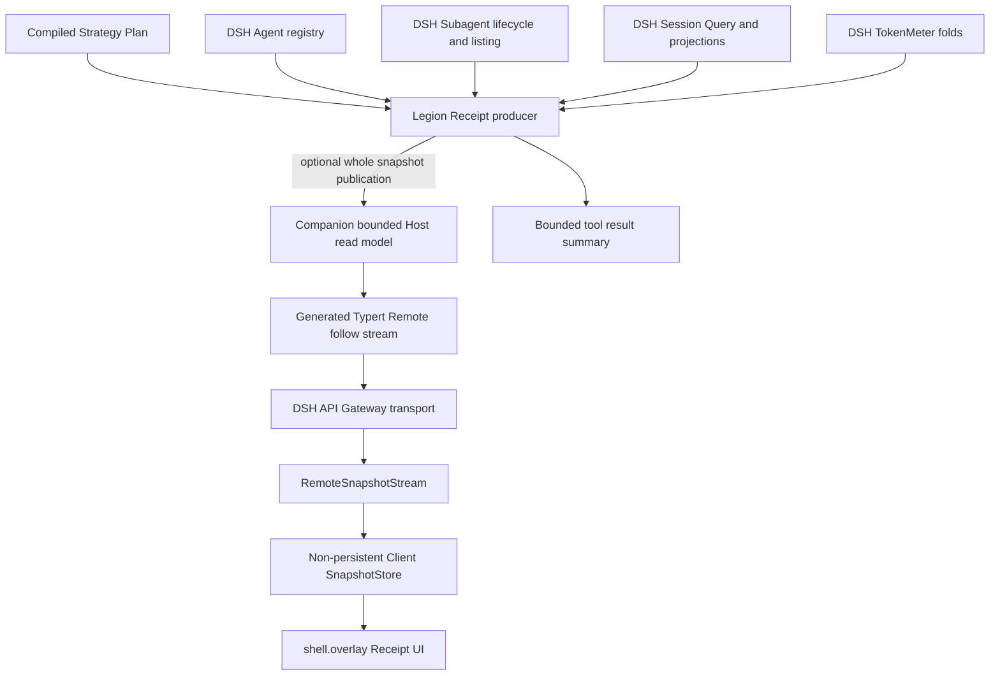
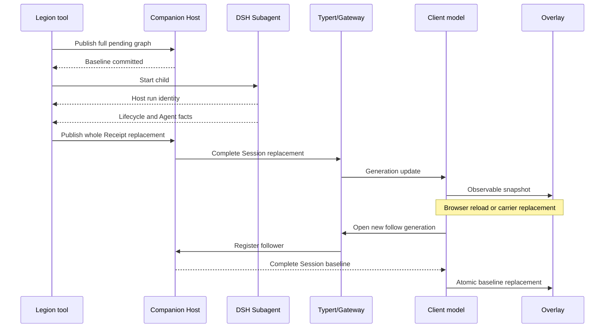
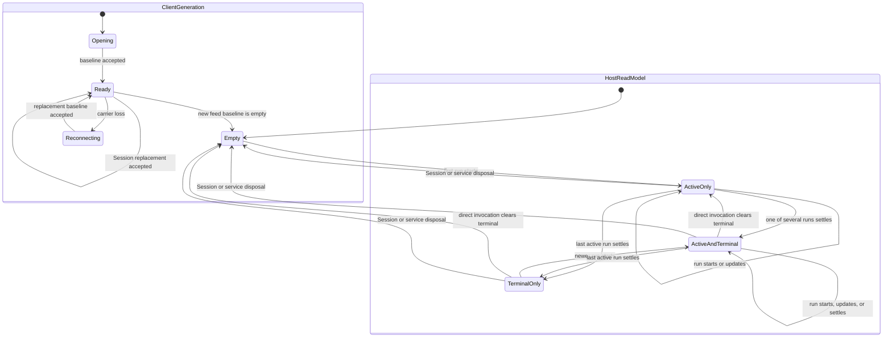
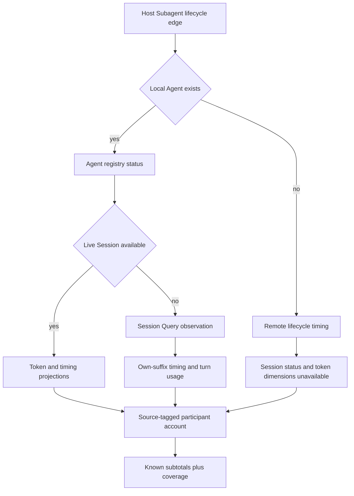
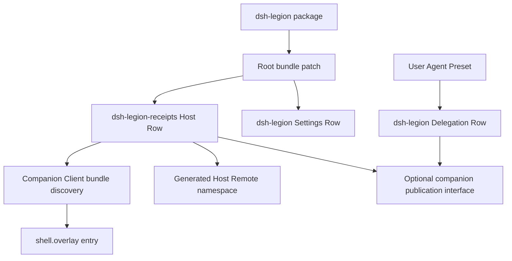
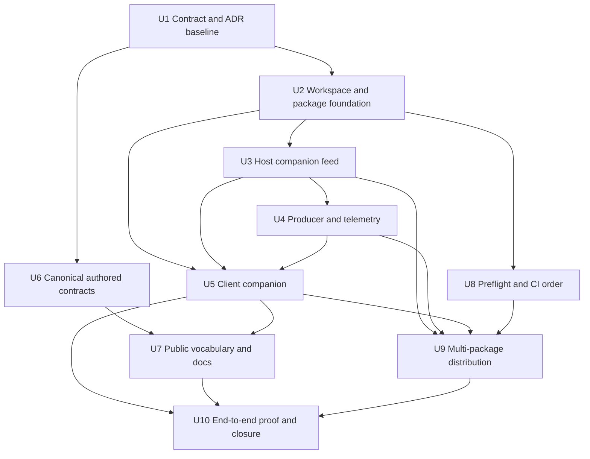

# Complete Run Receipt Visibility - Plan

## Goal Capsule

- **Objective:** A deployment owner can watch an honest live per-member Cohort Run account in Web, while headless or degraded deployments preserve ordinary delegation and receive an honest bounded terminal aggregate summary.
- **Means:** Replace the unsupported custom Session-event transport with a separately packaged Run Receipt companion that composes official DSH Remote, lifecycle, Session, token, Client store, and Slot modules (KTD1, KTD2).
- **Authority:** The revised product decision in [issue #2](https://github.com/wxxb789/dsh-legion/issues/2) governs behavior. `CONTEXT.md`, accepted ADRs, public contracts, and current DSH `0.1.2-alpha.1` source govern terminology and ownership. This plan governs implementation sequencing.
- **Execution profile:** Deep, cross-plane feature and compatibility migration. Implement each seam with externally observable characterization first, then run packed and real-browser proofs.
- **Stop conditions:** Do not modify DSH core, append a new `legion/*` Session event, persist full Receipt facts, parse model output for telemetry, create a scheduler or execution registry, change Durable Strategy behavior or journal bytes, or introduce a second model-facing tool.
- **Tail ownership:** The implementer owns focused verification, `pnpm run check`, direct commit and push to `main`, and the resulting GitHub Actions run under the repository rapid-development policy. A release tag or npm publication remains separately authorized release work.

---

## Product Contract

### Summary

Complete issue #2 by moving full Run Receipt delivery to a bounded Host-process companion feed while preserving the existing Legion execution path and bounded headless summary. Finish the Specialist/Cohort migration, dependency preflight, packaging, documentation, and public verification needed to make that behavior supportable.

### Problem Frame

The current implementation computes most Receipt facts correctly, but it publishes them through a custom `legion/run-receipt` Session event. DSH `0.1.2-alpha.1` persistence rejects downstream event types and exposes no registration seam, so Legion suppresses the event whenever `sessionPersistence` is mounted. The standard Web composition mounts persistence, which leaves the overlay without a baseline before or after refresh.

The initial implementation also lacks per-member elapsed display, treats Session-backed token projections too broadly, has no honest remote-child telemetry branch, and tests several internals instead of the public behavior. The vocabulary migration accepts `specialists` and `cohorts` at the top level, but current exports, nested authored contracts, configuration output, and Settings copy still expose retired nouns. Dependency preflight classifies many real gaps well, but its drift proof and CI ordering do not cover every registry-backed packed install.

### Actors

- A1. **Web observer:** Watches a live or just-settled Cohort Run and expects the current Session only.
- A2. **Headless coordinator:** Receives one bounded tool result and must not depend on Web or the companion.
- A3. **Deployment owner:** Installs the package pair, selects DSH providers, and needs truthful capability and dependency diagnostics.
- A4. **Maintainer:** Changes contracts, builds, tests, packs, and releases both packages without weakening DSH ownership.

### Key Decisions

- **Companion live feed.** Use a separate Host/Client companion instead of waiting for a future DSH custom-event registration seam or rejecting unsupported providers. This decision governs R1-R4 and R17-R19. `(session-settled: user-directed — chosen over preserving the unsupported Session projection or refusing persistent/remote runs: it delivers refresh-safe visibility without falsifying DSH ownership.)`
- **Live-session full facts.** Active full Receipt facts survive Client refresh and carrier reconnect while the same parent Session and companion instance live; a retained terminal is presentation state for that live Session, not cold history. Only the normal bounded tool result survives Session disposal, companion reload, or Host restart. This decision governs R2-R4 and R11.
- **Honest incomplete telemetry.** Missing remote Session facts or optional Host observation capabilities produce explicit unavailable or partial data, never zero-valued claims and never a delegation failure. This decision governs R7-R10 and R12.
- **Compatibility before cleanup.** Specialist/Cohort names become canonical, while published 1.x machine spellings and aliases remain supported through the promised compatibility window. This decision governs R14-R16.

### Requirements

**Receipt visibility and lifecycle**

- R1. When a compatible publisher is present, a Cohort Run must commit its full Compiled Strategy Plan graph before the first child starts; otherwise it records feed unavailable and continues without changing execution.
- R2. Each Client stream generation must begin with a complete Session-scoped baseline and then carry complete bounded Session read-model replacements; refresh or carrier reconnect must recover the same active Receipt while the parent Session and companion instance remain alive.
- R3. Full Receipt delivery must append no custom Session event and write no storage, projection cache, localStorage, file, database, or WAL; Session disposal, companion reload, or Host restart ends the full-fact lifetime and a new feed instance starts empty.
- R4. The Host read model must retain every active run plus the latest settled run per live parent Session, isolate concurrent Sessions, preserve concurrent run identities, and clear only a stale settled Receipt when a later direct Specialist invocation enters child admission.
- R5. Stage and outcome changes must come from the frozen plan and actual child settlement, not child narration, `lastAssistantMessage`, or model-authored progress.

**Participation, timing, and token truth**

- R6. Session-backed children must derive live `running | idle` status from the Agent registry, keep `ended` as a Receipt state rather than a registry status, subscribe before backfill, and map direct children by Host-issued identities.
- R7. Remote children must derive publication and result settlement from public `subagent/start` and `subagent/end`; direct children bind only when the returned `SubagentRun.id` equals the scoped lifecycle `info.id`, while nested remote descendants remain explicitly unobservable.
- R8. Every participant must expose elapsed data with its source: Session-backed active-turn timing from the DSH `subagentTiming` projection, or Host-observed wall time for remote lifecycle; unlike sources must not be presented as one precision class.
- R9. Every Session-backed participant must expose child-owned provider usage through official turn folds, exclude fork-seed ancestry, include post-seed compaction usage when reported, preserve exact totals and optional cache dimensions, and mark missing proof unavailable rather than zero.
- R10. Run aggregates must expose known subtotals plus complete, partial, or unavailable coverage and bounded truncation counts; neither full nor summary Receipt data may contain price, cost, money, or currency fields.

**Headless and direct-delegation parity**

- R11. Strategy tool results must keep a fixed-shape summary with run outcome, stage counts, participation counts and sources, run elapsed, known token subtotals, unavailable and truncation counts, coverage, and feed availability, with no child arrays.
- R12. Missing Web, API Gateway, companion, Session Query, TokenMeter, or optional observation services must not prevent ordinary Specialist or Strategy execution; unavailable observation dimensions must remain explicit and observation-only services must not be hard delegation dependencies.
- R13. The existing direct Specialist tool result remains the authoritative direct-delegation indicator; only a valid direct invocation that passes argument, config, route, and provider preflight may clear stale terminal presentation immediately before its first child-start attempt, without hiding an active Cohort Run.

**Canonical vocabulary and compatibility**

- R14. Current authored and exported vocabulary must use `specialist`, `specialists`, `defaultSpecialist`, `cohort`, and `cohorts` across top-level Config, Member Slots, Strategies, Catalog Layers, disable maps, package exports, Settings copy, examples, and current documentation.
- R15. Retired scalar aliases must conflict with their current spelling, retired map aliases may merge only disjoint entries, and every retired path must produce a structured replacement and removal-version diagnostic without mutating authored input.
- R16. Config version 3 must be the canonical dialect for new current interfaces and explicit target 3; published 1.x no-target materialize/export calls remain v2 until 2.0, while pure v1/v2-to-v3 migration preserves result bytes, digests, `team-run-` identities, durable journals, and historical fields.

**Official DSH reuse and package ownership**

- R17. Every non-domain concern must use its official DSH owner: Typert/Gateway transport and reconnect, Subagent and Agent lifecycle, Session Query and projections, TokenMeter folds, Client Store, Client Session, Locale, Slots, Layout, primitives, Loader smoke, replay LLM, and the official Client test runtime.
- R18. The new companion may own only strict Receipt DTO validation, stage/member binding metadata, availability and completeness semantics, a bounded process-local read model, domain baseline/update frames, and Receipt presentation.
- R19. The companion must be an independently built package mounted as an exact-name Host Loader row; the existing `dsh-legion` Settings Row must remain service-free and the Agent Preset must remain the only owner of the delegation tool and prompt.
- R20. Every official package imported at runtime must be a direct peer/dev dependency and, for Client values, both a direct `dsh.client.external` when required by the module table and a direct `dsh.client.inject` supplier; inline-safe self-generated artifacts must be declared and tested separately.

**Dependency availability and release gates**

- R21. Dependency preflight must derive its declared lines and closures from the compatibility policy, reject any direct DSH dependency, peer, or devDependency in either workspace importer that install evidence omits, and distinguish registry-install closure from runtime compatibility closure.
- R22. Host-line drift may be reported only when one common candidate generation has complete manifest evidence and its full resolution walk succeeds; missing evidence must produce incomplete evidence without a simultaneous drift claim.
- R23. Every upstream gap diagnostic, including a wholly unpublished package, must name the affected package, relevant range, and registry offers, while preserving distinct upstream, local, prerelease-only, and incomplete-evidence outcomes.
- R24. One fast, install-free registry preflight job must complete before every registry-backed install or packed compatibility job; source-tarball paths may skip the live registry only when they perform no registry-backed DSH resolution.

**Verification, documentation, and scope control**

- R25. Feature tests must assert generated contracts, feed frames, tool results, DOM output, package artifacts, and process behavior through public interfaces; provider, timer, or helper call counts may synchronize tests but may not be acceptance evidence.
- R26. Documentation, ADRs, the roadmap, changelog, compatibility policy, and issue #2 must describe the companion transport, live-Session/companion-instance lifetime, remote availability semantics, package installation, and canonical vocabulary without implying full Receipt persistence.
- R27. No implementation unit may modify `src/durable-run/**`, durable event schemas, replay fixtures, or durable digests; regression tests must prove those artifacts remain unchanged.
- R28. The overlay must define visible opening, empty, reconnecting, stale, partial, unavailable, terminal, invalid-frame, and Host-restart states, preserving last-known same-Session facts only where the state says they remain trustworthy.
- R29. The overlay must remain keyboard and screen-reader operable, restore focus after dismiss/reopen, expose status changes through bounded live-region announcements, and use a non-dragging full-width dock on narrow or touch layouts.

### Key Flows

- F1. **Session-backed Cohort Run**
  - **Trigger:** A coordinator invokes a Strategy in a persistent Web Host.
  - **Steps:** Legion commits the pre-start Receipt through the optional publisher, DSH starts children, Agent/Subagent/Session facts update the Receipt, the companion broadcasts whole replacements, and child settlement advances stages.
  - **Outcome:** A1 sees complete live facts and A2 receives the bounded terminal summary.
  - **Covered by:** R1-R6, R8-R12.
- F2. **Remote or mixed Cohort Run**
  - **Trigger:** A Strategy selects a provider whose `SubagentRun.localAgent` is absent, alone or beside local children.
  - **Steps:** The observer buffers lifecycle edges before binding, associates the Host run identity with stage/member metadata, records observed timing, and marks Session-only facts unavailable.
  - **Outcome:** Execution succeeds; Web and headless surfaces show known subtotals and partial or unavailable coverage without false zeros.
  - **Covered by:** R5, R7-R12.
- F3. **Refresh and reconnect**
  - **Trigger:** The browser reloads or the authenticated carrier is replaced during a run.
  - **Steps:** The Client remounts its generated Remote contribution, opens a new Session-scoped stream, accepts one baseline, and then resumes updates through the official reconnecting snapshot module.
  - **Outcome:** The same run returns without Client-persisted business state; a Host restart instead yields an empty baseline.
  - **Covered by:** R2-R4, R17-R20.
- F4. **Headless or degraded deployment**
  - **Trigger:** Legion runs without Web/companion or without an optional observation service.
  - **Steps:** The producer continues execution, keeps in-run facts, records unavailable dimensions, and returns the summary.
  - **Outcome:** Delegation behavior and outcome remain unchanged.
  - **Covered by:** R11-R12.
- F5. **Canonical and legacy configuration**
  - **Trigger:** A deployment supplies current names, retired names, disjoint mixed maps, or conflicting spellings.
  - **Steps:** Pure normalization emits structured diagnostics, rejects ambiguous entries, compiles one canonical model, and exports the requested dialect.
  - **Outcome:** New authors see one vocabulary while existing 1.x deployments retain compatibility.
  - **Covered by:** R14-R16.
- F6. **Registry-backed validation**
  - **Trigger:** CI, canary, or release work would resolve a DSH package from a registry.
  - **Steps:** The install-free preflight verifies the complete declared graph and evidence first, records its answer, and only a successful or explicitly non-applicable result releases downstream install jobs.
  - **Outcome:** A slow packed job never becomes the first or ambiguous reporter of an upstream publish gap.
  - **Covered by:** R21-R24.

### Acceptance Examples

- AE1. **Persistent Host baseline before work**
  - **Covers:** R1-R3.
  - **Given:** The standard persistence, Session, Agent, Subagent, projection, TokenMeter, Typert, and companion packages are mounted.
  - **When:** A two-stage Strategy starts and the first child is held pending.
  - **Then:** The Session log contains no `legion/run-receipt` event, while the companion baseline already contains both pending stages and their dependency edge.
- AE2. **Refresh while a local child works**
  - **Covers:** R2, R6, R8-R10.
  - **Given:** A local child is running with reported token usage.
  - **When:** The Client generation is disposed and recreated.
  - **Then:** The replacement generation first receives the same run baseline, then receives later idle, token, stage, and terminal replacements.
- AE3. **Remote child settles before binding**
  - **Covers:** R7-R12.
  - **Given:** A remote provider publishes a run with no local Agent and an already-resolved result.
  - **When:** `subagent/start` and `subagent/end` arrive before the caller binds stage metadata.
  - **Then:** The final Receipt still contains the correct child, stage, provider, observed elapsed, stop reason, and unavailable token dimensions; the Strategy succeeds.
- AE4. **Fork seed does not count as child usage**
  - **Covers:** R9-R10.
  - **Given:** A local child Session starts with ancestor events that already contain usage.
  - **When:** The child reports its own usage and settles.
  - **Then:** The Receipt attributes only the child-owned delta or exact own-turn fold and marks any unprovable dimension unavailable.
- AE5. **Concurrent isolation and direct distinction**
  - **Covers:** R4, R13.
  - **Given:** Two Sessions each have active runs, one Session has two concurrent runs, and one older terminal Receipt is retained.
  - **When:** The current Session changes, one run settles, and a valid direct Specialist invocation enters child admission.
  - **Then:** No frame crosses Session identity, all active runs remain selectable, and only the stale terminal clears before the direct child start.
- AE6. **Headless companion inactivity**
  - **Covers:** R11-R12.
  - **Given:** The exact companion dependency is installed with the root package, but a headless composition mounts only the Legion Agent row with no companion Host/Client row or Web runtime.
  - **When:** A Strategy completes.
  - **Then:** The tool returns the same outcome plus a bounded summary with feed unavailable; the Agent row never waits on the companion service.
- AE7. **Current and retired vocabulary**
  - **Covers:** R14-R16.
  - **Given:** Equivalent canonical-v3 and retired/v2 documents, plus a document that supplies both spellings for one entry.
  - **When:** Each is normalized and exported through its declared current or legacy interface.
  - **Then:** The v3 interface emits current names, published 1.x no-target calls remain v2, retired input reports replacement/removal diagnostics, the conflict fails, and neither authored object changes.
- AE8. **Incomplete registry evidence cannot become drift**
  - **Covers:** R21-R23.
  - **Given:** A snapshot omits one candidate manifest while package version lists share a newer generation.
  - **When:** Preflight evaluates drift.
  - **Then:** It returns incomplete evidence, does not emit host-line drift, and names the missing manifest.
- AE9. **Preflight gates every registry install**
  - **Covers:** R24.
  - **Given:** Quality, packed compatibility, canary, and release workflow graphs.
  - **When:** The graph is inspected or executed on a registry-backed path.
  - **Then:** Every install job depends on the successful preflight job; source-only paths identify themselves as non-applicable rather than silently passing a live check.
- AE10. **Installed package pair reaches Web**
  - **Covers:** R17-R20, R25-R27.
  - **Given:** Packed root and companion artifacts are installed into a real DSH Web profile.
  - **When:** The profile boots and a Strategy runs beside another overlay occupant.
  - **Then:** The exact companion row and Client export load, the overlays coexist, refresh restores Host facts, full Receipt facts are absent from localStorage, and durable journal artifacts remain unchanged.
- AE11. **Accessible presentation states**
  - **Covers:** R28-R29.
  - **Given:** Opening, partial, reconnecting, invalid-frame, terminal, and empty baselines are exercised at desktop and narrow/touch viewports.
  - **When:** A keyboard-only user selects, dismisses, reopens, and docks the panel.
  - **Then:** Each state has distinct visible and announced semantics, focus follows the documented path, action targets remain operable, and no drag is required on the narrow/touch dock.

### Success Criteria

- A persistent real-Host run is visible before its first child starts and remains visible after browser refresh without any custom Session event.
- Local, remote, mixed, cold, missing-capability, concurrent, reconnect, and Host-restart scenarios produce the documented complete, partial, or unavailable states.
- The root package and companion install and build from source, packed artifacts, and the supported DSH source line without relying on transitive runtime imports.
- Current documentation and UI use Specialist/Cohort vocabulary; explicit compatibility guards are the only remaining retired spellings.
- All focused gates, `pnpm run check`, packed compatibility matrices, browser smoke evidence, and the resulting `main` CI run pass.

### Scope Boundaries

#### Deferred to Follow-Up Work

- Historical full-Receipt query/export across Host restarts or past Sessions.
- Provider-specific remote usage adapters if DSH later publishes a generic usage seam.
- Automatic exposure or recommendation changes based on Receipt history.

#### Outside This Product's Identity

- DSH core event-vocabulary registration, persistence, transport authentication, retry/backoff, Session loading, Agent/Subagent execution, token estimation, shell layout, or renderer ownership.
- Monetary accounting or pricing.
- A generic telemetry framework, workflow engine, scheduler, daemon, process supervisor, or execution registry.
- Pixel redesign beyond making the existing overlay truthful and operable.

### Sources

- [Issue #2: Run Receipt, live participation, and dependency preflight](https://github.com/wxxb789/dsh-legion/issues/2)
- `CONTEXT.md`
- `docs/adr/0022-host-plane-settings-row.md`
- `docs/solutions/integration-issues/settings-namespace-preset-fiber-lifetime.md`
- `docs/solutions/integration-issues/upstream-publish-gap-reads-as-a-legion-regression.md`
- [DSH Session projection contract](https://github.com/deepseek-ai/deepseek-harness/blob/dsh-v0.1.2-alpha.1/packages/session/session-projection/src/index.ts)
- [DSH Typert Remote protocol](https://github.com/deepseek-ai/deepseek-harness/blob/dsh-v0.1.2-alpha.1/packages/typert/protocol/src/index.ts)
- [DSH Typert generator](https://github.com/deepseek-ai/deepseek-harness/blob/dsh-v0.1.2-alpha.1/packages/typert/generator/src/tsdown-plugin.ts)
- [DSH Workspace baseline/update feed pattern](https://github.com/deepseek-ai/deepseek-harness/blob/dsh-v0.1.2-alpha.1/packages/api/workspace-controller/src/feed.ts)
- [DSH RemoteSnapshotStream](https://github.com/deepseek-ai/deepseek-harness/blob/dsh-v0.1.2-alpha.1/packages/api/gateway/src/client/snapshot-stream.ts)
- [DSH Subagent lifecycle](https://github.com/deepseek-ai/deepseek-harness/blob/dsh-v0.1.2-alpha.1/packages/subagent/subagent/src/lifecycle.ts)
- [DSH Session observation](https://github.com/deepseek-ai/deepseek-harness/blob/dsh-v0.1.2-alpha.1/packages/session-query/session-query/src/observation.ts)
- [DSH exact turn usage fold](https://github.com/deepseek-ai/deepseek-harness/blob/dsh-v0.1.2-alpha.1/packages/llm/token-meter/src/turn-usage.ts)
- [DSH Client test runtime](https://github.com/deepseek-ai/deepseek-harness/blob/dsh-v0.1.2-alpha.1/packages/test-support/client-runtime/src/index.ts)
- [DSH Loader smoke harness](https://github.com/deepseek-ai/deepseek-harness/blob/dsh-v0.1.2-alpha.1/packages/test-support/loader-smoke/src/index.ts)
- [DSH replay LLM](https://github.com/deepseek-ai/deepseek-harness/blob/dsh-v0.1.2-alpha.1/packages/test-support/llm-replay/src/index.ts)

---

## Planning Contract

### Key Technical Decisions

- KTD1. **Expose one deep companion module.** `(session-settled: user-directed — chosen over preserving the unsupported Session projection or refusing persistent/remote runs: the companion delivers refresh-safe visibility without changing DSH core.)` The local producer crosses one optional publication interface, the Host exposes one read-only `follow` Remote stream, and the Client consumes one observable model. This implements R1-R4 and R17-R20 while hiding transport, retention, and lifecycle complexity from Legion execution.
- KTD2. **Compose official DSH modules for every non-domain concern.** Typert generated Remote descriptors, API Gateway stream supervision, Subagent and Agent lifecycle, Session Query, Session projections, TokenMeter folds, Client Store, Client Session, Locale, Slots, Layout, primitives, Loader smoke, replay LLM, and Client Test Runtime remain their owners. Custom code is allowed only for R18. This examined and upheld the user's reuse directive: no official package offers an externally writable Session projection or generic third-party domain feed.
- KTD3. **Use bounded whole-Session replacement state.** The Host retains all active runs plus one latest terminal run for each live Session and assigns one monotone Session revision. Each follower retains at most one pending complete Session replacement, so revision gaps are legal and no per-run remove/gap protocol exists. Hard limits permit at most 16 active Receipts per Session, 256 participant rows per Receipt, a 1 MiB serialized Session replacement, and 64 process-wide followers; an exceeded cap rejects feed publication or following with an explicit unavailable reason but never changes delegation. A cap-saturating benchmark must keep synchronous publication p95 at or below 100 ms and use one shared immutable replacement reference per follower; a failure reopens the caps or whole-Session protocol before U4.
- KTD4. **Make publication synchronous and presentation asynchronous.** A successful publication updates the Host baseline before returning. Followers register before baseline capture. Generated Remote and `RemoteSnapshotStream` own transport generations and reconnect; an opening baseline unconditionally resets Session revision after a new Host instance. The shared strict Zod parser validates shape and semantic refinements before Host mutation and after Client decode because DSH `0.1.2-alpha.1` does not validate yielded stream values.
- KTD5. **Inherit DSH's single-owner browser trust model.** An authenticated DSH browser principal may read live Receipt metadata for Sessions in that Host, matching the Session Controller's process-level authority. Current-Session filtering is presentation isolation, not authorization. Gateway authentication and origin rejection remain DSH-owned and receive integration coverage; the DTO allowlist excludes Objective, prompt, model output, and artifact bodies.
- KTD6. **Bind local and remote facts by public identity.** The producer installs Agent and scoped Subagent listeners before the first start, buffers lifecycle edges by `info.id`, and binds a direct child only when the returned `SubagentRun.id` matches. It retains the lifecycle `runId` for settlement. Local status remains Agent-registry truth, remote state remains Subagent-lifecycle truth, nested remote ancestry is unavailable, and `subagent/end` means result-settled rather than resource-quiescent.
- KTD7. **Account tokens from provider evidence, not pressure.** Live local values are provisional unless raw evidence proves each dimension. Terminal/cold reconciliation applies `deriveTurnTokenUsage` to complete post-seed turns and separately includes reported post-seed compaction usage. `tokenMeter.measure` may synchronize a cut but cannot become consumed-token truth. Exact total, input, output, and optional cache dimensions keep independent reported or unavailable states.
- KTD8. **Keep business and presentation state separate.** The Client model uses non-persistent `createSnapshotStore`; only dock, selected run, dismissal, and desktop position use the persisted Store seat. Session navigation clears the old view, aborts and awaits the old stream, and fences every callback by address epoch. Same-Session reconnect keeps last-known facts marked stale until a replacement baseline arrives.
- KTD9. **Add Config v3 without breaking 1.x defaults.** New current interfaces and explicit target 3 use canonical top-level and nested names. Existing 1.x no-target materialize/export calls remain v2 until 2.0; v2, v1, and legacy-unversioned stay explicit migration/export targets. Existing serialized result contracts and durable wires remain on a compatibility allowlist, and diagnostics state replacement plus removal no earlier than `2.0.0`.
- KTD10. **Prove dependency drift by complete install evidence.** Registry-install closure covers every direct DSH dependency, peer, and devDependency across workspace importers; runtime compatibility closure remains separately named. Candidate Host generations enter drift comparison only after complete manifests and a successful dependency walk. A dedicated install-free CI job gates every registry-backed install, while source-tarball CI remains a separate claim.
- KTD11. **Ship a trusted, version-coupled workspace pair.** `dsh-legion-receipts` owns the DTO, Host module, Remote namespace, and Client UI without depending on the root. The root carries the exact workspace dependency and consumes its public publication interface. Build and release evidence bind both artifacts, reserve and verify the companion npm identity and OIDC Trusted Publisher, publish companion before root, and make reruns byte-identity idempotent.

### DSH Reuse Contract

| Concern | Official owner to use | New Legion-owned delta | Forbidden replacement |
|---|---|---|---|
| Host Remote namespace and stream method | `@deepseek-ai/dsh-typert-protocol` | Receipt `follow` method and DTOs | Handwritten RPC codec or direct Connection calls |
| Generated Host/Client artifacts | `@deepseek-ai/dsh-typert-generator/tsdown` | Package exports and build wiring | Handwritten Remote descriptors |
| Authenticated transport, reconnect, generations | `@deepseek-ai/dsh-api-gateway` and `RemoteSnapshotStream` | Receipt frame discriminator and revision guard | WebSocket, SSE, EventSource, polling, custom HTTP, retry loop |
| Client Remote namespace | `@deepseek-ai/dsh-api-remotes/client` and `ctx.remote.$mount` | Self-mount the companion contribution | Modifying the official closed BFF list |
| Local live status | `@deepseek-ai/dsh-agent` | Stage/member association | A second Agent registry or fabricated status |
| Child publication and settlement | `@deepseek-ai/dsh-subagent` lifecycle and run handle | Race buffer and Receipt binding | Provider wrapper or second child state machine |
| Cold descendants and exact Session cut | `listDescendants` plus `sessionQuery.observeSession` | Coverage classification | Persistence scan or Session loader |
| Timing | `subagentTiming` projection | Source-tagged member timing | One unlabeled precision class |
| Token usage | `tokenUsage`, `deriveTurnTokenUsage`, and bounded `tokenMeter.measure` use | Seed baseline, per-dimension availability, tree subtotal | Transcript parser, estimator, provider-private wire, price table |
| Client state | `@deepseek-ai/dsh-client-store` | Receipt model reducer | Homegrown global store or business-data localStorage |
| UI integration | Locale, UI Session, Slots, Layout, primitives | Receipt overlay composition and styles | Direct DOM mount, shell fork, UI renderer installation |
| Client behavior tests | `@deepseek-ai/dsh-client-test-runtime` | Receipt fixtures and assertions | Hand-built renderer/Slot implementation |
| Deterministic Host/model smoke | `@deepseek-ai/dsh-loader-smoke` and `@deepseek-ai/dsh-llm-replay` | Receipt-specific composition and replay fixtures | Custom process harness or expanding the scripted adapter |

### High-Level Technical Design

#### Module topology



The companion is deep at two seams: Legion learns only the optional publication interface, and the Client learns only the observable Receipt model. Deleting the companion would force baseline, reconnect, retention, and Slot integration back into callers, so the module earns its interface.

#### Pre-start publication and refresh sequence



#### Host retention and Client generation states



#### Telemetry source and availability flow



This branch implements KTD5 and KTD6. It never substitutes one source for another and never converts missing evidence to zero.

#### Package and plane ownership



The Settings Row remains service-free, the Delegation Row remains preset-scoped, and the companion is the only process-wide Receipt module.

#### Overlay presentation state matrix

| Model state | Visible behavior | Trust and action |
|---|---|---|
| Opening | Compact panel says the live Receipt feed is loading | No prior Session facts are shown |
| Ready with no run | Neutral empty state says no Cohort Run exists in this live Session | Direct Specialist results remain in conversation tool results |
| Active | Run header, stage overview, participant summary, and aggregate coverage are visible | Detailed per-member token/source fields are disclosed on demand |
| Partial | Known facts remain visible with partial badges and unavailable/truncated counts | No known subtotal is labeled as a total |
| Reconnecting | Last accepted same-Session facts remain visible with a stale/reconnecting badge | No later state is inferred until a new baseline arrives |
| Feed unavailable or incompatible | Panel and launcher show unavailable with a correction-oriented diagnostic | Delegation remains usable through tool results |
| Invalid frame or terminal stream failure | Last valid facts remain visible with an update-error state | Invalid data never replaces the accepted model |
| Settled | Terminal outcome remains inspectable until replaced, cleared, dismissed, or Session disposal | Success and failure receive the same retention rule |
| Direct invocation cleared terminal | Neutral empty state identifies that the latest delegation was direct | Active Cohort Runs remain selectable |
| New empty feed instance | Empty state says full facts ended with the prior Session/companion instance | Historical bounded summary remains in conversation history |

Information hierarchy is fixed: compact run/feed header first, stage progress second, participants grouped by stage third, and aggregate known subtotals/coverage last. Participant rows show member, state, elapsed, and availability by default; token dimensions and source detail use an accessible disclosure.

Selection is deterministic. Active runs sort newest first and outrank the retained terminal. A persisted selection is reused only for the same Session and a still-retained, non-dismissed run; otherwise selection falls back to newest active, then latest terminal. Dismissal is keyed by Session and run. A persistent Run Receipts launcher always permits reopening, and dismissal falls through to another undismissed active run when one exists.

At viewport widths below 640 CSS pixels or in touch-constrained layout, the panel becomes a full-width bottom dock and drag is disabled. Action targets are at least 44 by 44 CSS pixels. The run selector uses a native control. Dock, dismiss, and reopen are keyboard accessible with visible focus; dismiss returns focus to the launcher, reopen moves focus to the panel heading, and only reconnect, feed error, and terminal outcome changes use `aria-live="polite"`.

### Output Structure

```text
packages/
  run-receipt-feed/
    package.json
    tsconfig.json
    tsconfig.host.json
    tsconfig.client.json
    tsdown.config.ts
    tsdown.client.config.ts
    src/
      index.ts
      feed.ts
      types.ts
      client/
        index.ts
        model.ts
        RunReceiptOverlay.ts
        locales.ts
        styles.ts
    tests/
      host-feed.spec.ts
      remote-transport.spec.ts
      client-overlay.spec.ts
      package.spec.ts
build/
  client-bundle.ts
docs/
  adr/
    0023-host-plane-settings-row.md
    0024-run-receipt-live-feed.md
  plans/
    2026-08-30-0034-feat-run-receipt-completion-plan.md
```

The tree shows the intended new hierarchy. Unit file lists remain authoritative if implementation finds a smaller arrangement.

### Sequencing



### Risks and Mitigations

| Risk | Consequence | Mitigation |
|---|---|---|
| Remote start/end races binding | Missing or misattributed participant | Subscribe before start, buffer by scoped `info.id`, and bind only the matching returned child id |
| Fork seed or compaction pollutes token totals | Ancestor usage is charged or provider usage is omitted | Partition at `header.seedLength`, use official turn folds, and include reported compaction usage |
| Stream reconnect shows another Session | Cross-session UI misinformation | Address streams by Session, fence callbacks by navigation epoch, and clear before opening a new address |
| Host followers or frames grow | Process memory, CPU, or publication latency harms delegation | Whole-Session coalescing, hard caps, immutable shared frames, and the 100 ms p95 falsification gate |
| Companion becomes execution authority | DSH lifecycle ownership is violated | Keep the publication interface observation-only; no start, cancel, retry, resume, scan, or scheduling methods |
| Generated Remote artifact is externalized | Client loader drops or throws on self-import | Inline the companion's generated `./remote` and Zod wire dependencies in the shared Client build helper |
| Browser trust is mistaken for per-Session authorization | Client filtering is credited as a security boundary | Document the single-owner Host model and test official Gateway authentication/origin rejection |
| Sensitive plan or model content leaks through DTO spread | Prompt, Objective, output, or artifact bytes reach Client/logs | Allowlist leaf fields and run end-to-end sentinel-canary tests |
| Workspace pair drifts or lacks a trusted npm identity | Root loads an incompatible package or release cannot publish safely | Couple versions and evidence, reserve OIDC Trusted Publisher, publish companion first, and make reruns identity-idempotent |
| Canonical rename changes digests or durable bytes | Existing deployments cannot replay or compare catalogs | Normalize before compilation and keep an explicit golden compatibility allowlist |
| Registry evidence is missing | CI invents a pass or false drift | Preserve incomplete-evidence as a non-success outcome and prohibit drift without complete walk evidence |
| Current DSH line is not publicly resolvable | Release cannot install despite source CI passing | Keep source and distribution claims separate; require public-registry preflight before release |

### Alternative Approaches Considered

- **Keep the custom Session event and projection:** Rejected because persistence refuses downstream event types and no public registration seam exists.
- **Modify DSH core:** Rejected because Legion must consume public Host seams and the Host does not accept this as an external plugin patch path.
- **Use raw WebSocket, SSE, HTTP, or polling:** Rejected because API Gateway and Typert already own authentication, transport, stream generations, and reconnect.
- **Persist the full Receipt in localStorage:** Rejected because Client state would become stale authority after Host restart and would not be Host-derived.
- **Represent Cohort Runs as DSH Jobs:** Rejected because the Job interface exposes job lifecycle text, not the stage graph, participation, or token account, and would make presentation own execution semantics.
- **Reject persistent or remote providers:** Rejected because it would turn optional visibility into a hard execution dependency and break Legion customization.
- **Add the feed service to the existing Settings Row:** Rejected because that row's established contract is process-wide settings and Client discovery with no service, tool, prompt, or projection.
- **Add another Receipt role inside the same npm package:** Rejected by the user-settled separate-package decision and repository Host-ownership rule; it would make one package publish both the Agent-plane consumer and the Host capability it is required to obtain separately.

---

## Implementation Units

### Unit Index

| Unit | Title | Primary files | Depends on |
|---|---|---|---|
| U1 | Freeze the revised contract | `CONTEXT.md`, ADRs, public contracts | None |
| U2 | Establish the companion workspace | workspace, manifests, build configs | U1 |
| U3 | Implement the Host feed | companion Host types/feed | U2 |
| U4 | Rebuild Receipt observation | core Receipt/execution modules | U1, U3 |
| U5 | Move and reconnect the overlay | companion Client and UI tests | U2, U3, U4 |
| U6 | Canonicalize authored contracts | Config and orchestration contracts | U1 |
| U7 | Publish canonical vocabulary | exports, copy, examples, docs | U5, U6 |
| U8 | Harden dependency preflight | evaluator, fixtures, CI graph | U2 |
| U9 | Make distribution pair-aware | pack/install/release scripts | U2-U5, U8 |
| U10 | Prove and close the milestone | packed/browser evidence and issue | U5, U7, U9 |

### U1. Freeze the revised contract

- **Goal:** Record the approved live-Session/companion-instance behavior and remove contradictory claims before code changes establish another implicit contract.
- **Requirements:** R2, R3, R7-R10, R17-R19, R26-R27.
- **Dependencies:** None.
- **Files:**
  - `CONTEXT.md`
  - `docs/adr/0022-host-plane-settings-row.md` (rename)
  - `docs/adr/0023-host-plane-settings-row.md` (new path)
  - `docs/adr/0024-run-receipt-live-feed.md` (new)
  - `docs/public-contract-v1.md`
  - `contracts/v1.json`
  - `tests/documentation.spec.ts`
  - `tests/contract.spec.ts`
- **Approach:**
  1. Keep the nouns ADR as the sole ADR 0022 and renumber the Host-plane Settings decision to remove the current duplicate number.
  2. Record companion ownership, official DSH reuse, live-Session/companion-instance retention, remote unavailability, and no-persistence consequences in ADR 0024.
  3. Update the public contract additively and comment on issue #2 with the approved revision before changing runtime behavior.
  4. Freeze `src/durable-run/**`, journal schemas, and historical identifiers as compatibility exclusions.
- **Execution note:** Add failing documentation/contract assertions for the contradictory persistent-projection claims before editing prose.
- **Patterns to follow:** `docs/adr/0022-host-plane-settings-row.md`; `docs/solutions/integration-issues/settings-namespace-preset-fiber-lifetime.md`.
- **Test scenarios:**
  - Current docs describe full facts as live-Session/companion-instance scoped and the tool summary as the restart-safe artifact.
  - Exactly one ADR owns number 0022, and every renamed ADR link resolves.
  - Public contracts name the companion and current vocabulary while retaining explicit 1.x compatibility exceptions.
  - A guard fails if current prose reintroduces the retired projection transport or monetary accounting.
- **Verification:** Documentation and contract tests fail against the current claims and pass only after the revised contract is coherent.

### U2. Establish the companion workspace and generated Remote build

- **Goal:** Create a separately packaged Host/Client module that uses official generated Remote artifacts and shares one external-bundle implementation with the root package.
- **Requirements:** R17-R20, R25.
- **Dependencies:** U1.
- **Files:**
  - `pnpm-workspace.yaml`
  - `package.json`
  - `pnpm-lock.yaml`
  - `tsconfig.json`
  - `tsconfig.host.json` (new)
  - `tsconfig.client.json` (new)
  - `tsdown.client.config.ts`
  - `build/client-bundle.ts` (new)
  - `cordis.patch.yml`
  - `packages/run-receipt-feed/package.json` (new)
  - `packages/run-receipt-feed/tsconfig.json` (new)
  - `packages/run-receipt-feed/tsconfig.host.json` (new)
  - `packages/run-receipt-feed/tsconfig.client.json` (new)
  - `packages/run-receipt-feed/tsdown.config.ts` (new)
  - `packages/run-receipt-feed/tsdown.client.config.ts` (new)
  - `packages/run-receipt-feed/src/types.ts` (new)
  - `packages/run-receipt-feed/tests/package.spec.ts` (new)
  - `tests/package.spec.ts`
  - `tests/client-bundle.spec.ts`
- **Approach:**
  1. Add `packages/*` to the workspace and define `dsh-legion-receipts` with concrete `.`, `./types`, `./client`, `./typert`, `./remote`, and `./package.json` exports.
  2. Make the companion `tsconfig.json` a solution that references separate Host and Client faces, and wire the workspace Host/Client aggregates to the matching package face.
  3. Use `@deepseek-ai/dsh-typert-generator/tsdown` in package mode and follow Host compile, Host Typert generation, Client compile, then Client bundle order.
  4. Extract the existing unavoidable DSH Client loader wrapper into `build/client-bundle.ts`; keep manifest-declared official module-table externals external while bundling the companion's own generated Remote contribution and Zod codecs.
  5. Add the exact companion Host row to the root bundle patch without adding a service to the existing Settings Row or a Host tool/prompt surface.
  6. Declare every directly consumed official DSH package as a direct peer/dev dependency and declare both required Client externals and their supplier injects.
- **Execution note:** This unit is build and packaging heavy; prove source build, generated artifacts, package exports, and loader identity before adding feed behavior.
- **Patterns to follow:** DSH Typert generator package mode; DSH experimental Client Agent Team self-mount pattern; the repository's current Client bundle protocol test.
- **Test scenarios:**
  - The Host build emits `typert.host` and `typert.remote-client` artifacts from source declarations, and a stale generated artifact cannot pass.
  - The companion manifest declares exact `platform: web`, Client export, Typert exports, and direct dependencies.
  - The root patch contains one Settings Row and one exact-name companion row; neither row publishes a global Legion tool.
  - Each built Client bundle registers under its own manifest name and requests only declared official module-table entries.
  - The companion's generated Remote contribution and Zod are bundled rather than requested from the frozen module table.
- **Verification:** A clean workspace build and dry pack contain every declared artifact, and package-contract tests reject missing exports, transitive-only dependencies, wrong Client IDs, or duplicate build-wrapper logic.

### U3. Implement the bounded Host companion feed

- **Goal:** Provide the process-local publication/read model and baseline-first Remote stream without acquiring execution or persistence authority.
- **Requirements:** R1-R4, R17-R20, R25.
- **Dependencies:** U2.
- **Files:**
  - `packages/run-receipt-feed/src/index.ts` (new)
  - `packages/run-receipt-feed/src/feed.ts` (new)
  - `packages/run-receipt-feed/src/types.ts`
  - `packages/run-receipt-feed/tests/host-feed.spec.ts` (new)
  - `packages/run-receipt-feed/tests/remote-transport.spec.ts` (new)
  - `packages/run-receipt-feed/tests/security.spec.ts` (new)
  - `benchmarks/receipt-feed-thresholds.json` (new)
  - `scripts/benchmark-receipt-feed.mjs` (new)
- **Approach:**
  1. Implement one `TypertRemoteService` that also exposes the small Host-only publication interface to Legion.
  2. Project only allowlisted leaf fields, then validate shape and semantic refinements: Session lifecycle identity, run key, unique stage/participant IDs, known dependency and binding references, monotone state, and aggregate arithmetic.
  3. Retain all active plus the latest terminal run for each live Session, assign one Session revision, and enforce KTD3 caps before mutation.
  4. Address `follow` with a plain JSON SessionId under the DSH authenticated single-owner Host model, register the follower before baseline capture, and keep only the latest pending complete Session replacement.
  5. Remove retained state on Session disposal, clear only terminal state for a later admitted direct invocation, and close every iterator on signal or Fiber disposal.
  6. Keep every frame lossless JSON and exclude Session, Agent, Service, model output, prompt, Objective, and artifact bodies from DTOs and logs.
- **Execution note:** Implement publication and `follow` test-first through their public interfaces; tests must not inspect the private map or follower queue.
- **Patterns to follow:** DSH `WorkspaceFeed` baseline/update ordering; `TypertRemoteService`; DSH Gateway authentication; Cordis effect-owned disposal.
- **Test scenarios:**
  - Opening a follower with no Receipt yields one empty baseline before any update.
  - Publishing a pending graph commits synchronously, and a new follower sees the complete Session model in its baseline.
  - Each update atomically replaces the complete Session model, preserves concurrent runs, and keeps the latest terminal beside active runs.
  - A direct invocation clears the retained terminal but not active Cohort Runs.
  - Two Sessions receive isolated frames; an id-reused Session with a different lifecycle cannot see stale data.
  - Duplicate publication is inert; cross-Session binding, unknown stage edge, or inconsistent aggregate is rejected without changing the baseline, and only accepted non-duplicate mutations increment the Host-owned Session revision.
  - A slow follower skips intermediate revisions and receives one latest complete Session replacement.
  - Each KTD3 follower, run, participant, and byte cap rejects excess work with explicit availability while delegation continues.
  - A cap-saturating 1 MiB model with 16 active runs and 64 followers stays within the 100 ms synchronous-publication p95 threshold; failure stops before U4 and reopens KTD3.
  - Session disposal, signal abort, and service disposal close followers and remove state; a new service instance starts empty.
  - Unauthenticated or wrong-origin Gateway stream upgrades receive the official rejection, while an authenticated browser follows any live Session under the documented single-owner trust model.
  - Objective, primitive prompt, child output, and artifact sentinel canaries are absent from Host state, serialized frames, Client state, localStorage, and captured logs.
- **Verification:** The Host package exposes only publication and read-only follow interfaces, owns no timer or storage, and passes semantic-parser plus real generated Typert/Gateway integration tests.

### U4. Rebuild Receipt observation and honest telemetry

- **Goal:** Replace Session-event publication with the optional companion publisher and produce complete or explicitly incomplete local, remote, and cold facts.
- **Requirements:** R1, R5-R13, R17-R18, R25, R27.
- **Dependencies:** U1, U3.
- **Files:**
  - `src/run-receipt.ts`
  - `src/execution.ts`
  - `src/index.ts`
  - `src/identity.ts`
  - `tests/plugin.spec.ts`
  - `tests/execution.spec.ts`
  - `tests/run-receipt-compatibility.spec.ts` (replace or remove)
  - `tests/token-meter-test-service.ts` (remove)
  - `tests/run-receipt-telemetry.spec.ts` (new)
- **Approach:**
  1. Remove production `legion/run-receipt` append/projection registration and resolve the companion publication interface optionally on each whole-snapshot commit.
  2. Remove observation-only services from the delegation row's hard inject list and read them through optional official interfaces; keep only services required to execute a delegation as hard dependencies.
  3. Keep the existing pre-start plan construction and settlement-driven stage transitions, but make observation failures data rather than Strategy failures.
  4. Install Subagent and Agent listeners before child admission, buffer scoped lifecycle edges by `info.id`, bind only to the matching returned `SubagentRun.id`, and retain the lifecycle `runId` for settlement.
  5. Use registry status and `sessionQuery.observeSession` for local children; own each observation lease in the narrowest `using` or `try/finally` scope across success, cancellation, truncation, and per-child failure, while reporting nested remote ancestry and missing evidence through coverage.
  6. Treat `Session.header.seedLength` as the immutable ownership boundary, partition post-seed events into complete turn windows for `deriveTurnTokenUsage`, include reported post-seed compaction usage, and mark active/incomplete evidence provisional or unavailable rather than sampling a late baseline.
  7. Add source-tagged per-member timing and independently reported or unavailable token dimensions, then update fixed-shape summary, truncation counts, feed status, and tool output schema.
  8. After argument/config/route/provider preflight succeeds and immediately before the first direct child-start attempt, ask the optional publisher to clear stale terminal presentation without changing active Cohort Runs.
- **Execution note:** Characterize current graph and summary behavior first, then replace projection assertions with publisher-interface outcomes. Use real DSH observation modules in integration coverage.
- **Patterns to follow:** Current subscribe-before-backfill logic; DSH Agent and Subagent lifecycle contracts; `sessionQuery.observeSession`; `subagentTiming`; `deriveTurnTokenUsage`.
- **Test scenarios:**
  - Covers AE1. The full graph is published before a held child starts, and no custom Session event exists.
  - Local Agent status moves running to idle to ended, with `ended` outside the registry-status vocabulary.
  - A child that predates observation is found by backfill and mapped to its stage by Host identity.
  - A local fork child that settles before `SubagentRun` binding still uses `header.seedLength`, includes its own complete turns, and excludes seeded usage.
  - Covers AE3. Remote start/end both arrive before stage binding and still produce one correctly bound terminal participant.
  - Two Strategy starts and one direct start interleave under one parent without event-order, label, or time-based correlation.
  - A nested remote child that public lifecycle cannot attribute is omitted with explicit incomplete coverage rather than guessed into the root stage.
  - Covers AE4. Fork seed usage is excluded, retry attempts are not double-counted, and reported compaction usage is included in child-owned totals.
  - A provider that reports no cache bucket produces an unavailable cache dimension, not zero.
  - Mixed local/remote fanout reports local known subtotal, remote unavailable count, and partial aggregate coverage.
  - A forced participant cap reports the exact truncation count and partial coverage in both full DTO and bounded summary.
  - Cold descendants use a real Session observation lease and dispose it; a diagnostic descendant or missing Session Query marks coverage incomplete without reading persistence privately.
  - Token sampling occurs only on lifecycle/status/settlement edges, never when a Client renders or reads a Receipt.
  - Objective, prompt, output, artifact, and log canaries cannot enter publication or summary data.
  - Missing companion and observation services remove no execution capability or hard-inject readiness and set bounded summary availability fields.
  - Durable journal fixtures and digests are byte-identical before and after the unit.
- **Verification:** Tool schema, tool result, publisher snapshots, real public lifecycle events, and official token folds prove behavior without private helper or provider call-count acceptance assertions.

### U5. Move the overlay to the reconnecting Client companion

- **Goal:** Consume the companion Remote stream through official Client modules and render current-Session, per-member, concurrency-aware Receipt facts.
- **Requirements:** R2-R4, R6-R13, R17-R20, R25, R28-R29.
- **Dependencies:** U2, U3, U4.
- **Files:**
  - `src/client/index.ts`
  - `src/client/RunReceiptOverlay.ts` (move)
  - `src/client/locales.ts`
  - `src/client/styles.ts`
  - `packages/run-receipt-feed/src/client/index.ts` (new)
  - `packages/run-receipt-feed/src/client/model.ts` (new)
  - `packages/run-receipt-feed/src/client/RunReceiptOverlay.ts` (new)
  - `packages/run-receipt-feed/src/client/locales.ts` (new)
  - `packages/run-receipt-feed/src/client/styles.ts` (new)
  - `packages/run-receipt-feed/tests/client-overlay.spec.ts` (new)
  - `tests/client-bundle.spec.ts`
- **Approach:**
  1. Leave the root Client bundle with the Settings card only; move Receipt UI, copy, styles, and presentation store into the companion package with its own package/style identity.
  2. Self-mount the generated Remote contribution, open one plain-SessionId stream through `ctx.remote.$stream`, and consume it with `RemoteSnapshotStream` into a non-persistent SnapshotStore.
  3. Fence every callback by Session address and selection epoch; navigation clears the old view, aborts and awaits the old stream, then accepts the new generation baseline unconditionally while rejecting lower or equal update revisions within that generation.
  4. Expose the business model to `shell.overlay` through a Slot inject hook; keep the official persisted Store seat only for dock, desktop position, selected run, and Session/run dismissal.
  5. Implement the presentation state matrix, deterministic selection/fallback/launcher rules, fixed information hierarchy, narrow/touch dock, keyboard focus path, and bounded live-region announcements under R28-R29.
  6. Render local registry status, remote lifecycle status, source-labeled elapsed, independently reported token dimensions, unavailable reasons, truncation, and aggregate coverage without labeling known subtotals as totals.
  7. Use official Button, Pill, StateDot, locale, Slot, and test-runtime behavior where those modules fit; keep only Receipt-specific layout and desktop drag logic local.
- **Execution note:** Replace hand-built renderer tests with the official Client test runtime before changing interactions; keep the built-artifact loader protocol as a separate lane.
- **Patterns to follow:** DSH Workspace Client `RemoteSnapshotStream` model; experimental Agent Team generated Remote self-mount; current persisted overlay preference store.
- **Test scenarios:**
  - Covers AE2. Recreating the Client generation receives a baseline for the same active run and continues updates.
  - Rapid Session A-to-B-to-A navigation rejects every delayed callback from an older address epoch and never displays another Session's facts.
  - Covers AE5. Concurrent runs sort active-newest first, preserve a valid selected run, and fall back to newest active then latest terminal after settlement, clear, or dismissal.
  - Per-member rows show state and elapsed in the default hierarchy; accessible detail exposes token/source fields, and mixed aggregates say known subtotal rather than total.
  - Opening, empty, active, partial, reconnecting/stale, unavailable, invalid-frame, settled, direct-clear, and new-instance states render the matrix's distinct message and actions.
  - Carrier loss preserves the accepted same-Session view as stale; an opening baseline resets revision, while lower or equal same-generation updates are rejected without replacing valid facts.
  - Dismiss falls through to another active run or the persistent launcher, restores launcher focus, and reopen focuses the panel heading; no full Receipt enters localStorage.
  - Narrow/touch layout uses the full-width dock with no drag, every action meets the target size, keyboard-only control works, and bounded live-region announcements fire only for specified transitions.
  - Another `shell.overlay` occupant remains rendered, both overlays' controls work, and conversation interaction remains unobstructed.
  - Missing or incompatible remote namespace reports feed unavailable without crashing the Settings card or conversation.
  - The built companion bundle contains the generated Remote contribution and registers the exact manifest ID, Client export, platform, styles, and official externals.
- **Verification:** DOM assertions use the production SlotRegistry/renderer/store through `@deepseek-ai/dsh-client-test-runtime`; generated transport and built-bundle tests prove behavior that a scripted prop object cannot.

### U6. Canonicalize Config and orchestration authoring

- **Goal:** Make Specialist/Cohort spellings the canonical authored and compiled interface at every non-versioned Config and orchestration seam while preserving legacy input.
- **Requirements:** R14-R16, R27.
- **Dependencies:** U1.
- **Files:**
  - `src/config.ts`
  - `src/orchestration-contract.ts`
  - `src/catalog-layer.ts`
  - `src/default-catalog.ts`
  - `src/compiler.ts`
  - `src/orchestration.ts`
  - `src/resources.ts`
  - `src/input.ts`
  - `src/cli.ts`
  - `tests/config-version.spec.ts`
  - `tests/cli.spec.ts`
  - `tests/bin.spec.ts`
  - `tests/catalog-layer.spec.ts`
  - `tests/orchestration.spec.ts`
  - `tests/compiler.spec.ts`
  - `tests/resources.spec.ts`
  - `tests/types.ts`
- **Approach:**
  1. Extend the existing pure namespace normalizer to `defaultSpecialist/defaultProfile`, Member Slot `specialist/profile`, Strategy `cohort/team`, Catalog Layer maps, and disable lists.
  2. Add pure Config v2-to-v3 migration and construct one canonical v3 representation before validation, routing, digesting, or execution.
  3. Emit structured replacement and `2.0.0` removal diagnostics for every retired path, and reject ambiguous scalar or same-entry map combinations.
  4. Add new current v3 materialize/export interfaces and explicit target 3 while keeping published 1.x no-target materialize/export behavior on v2 until 2.0.
  5. Route structured migration diagnostics through library, CLI human, and CLI JSON surfaces.
  6. Preserve digest inputs and durable/versioned serialized spellings through explicit adapters and golden fixtures.
- **Execution note:** Add current/legacy/conflict parity tables before refactoring the model; prove digest preservation on every intermediate commit.
- **Patterns to follow:** `CONFIG_NAMESPACE_VOCABULARY`, `mergeNamespaceEntries`, `mergeNamespaceNames`, and `materializeCompiledConfigWithDiagnostics`.
- **Test scenarios:**
  - Covers AE7. Current-only and retired-only documents compile to equal canonical catalogs, with warnings only for retired paths.
  - Disjoint current/retired maps merge deterministically; duplicate entry and scalar dual spelling fail loudly.
  - Nested Layer, disable, Member Slot, Strategy, and default selection diagnostics contain exact authored path, replacement, and removal version.
  - Normalization and export do not mutate or alias any authored object.
  - New current and explicit target-3 exports contain no retired key; explicit legacy targets round-trip when lossless and reject unsupported current-only features.
  - Published 1.x no-target materialize/export calls continue to return v2 until the major-version gate changes.
  - CLI human and JSON output expose every top-level and nested replacement/removal diagnostic.
  - Current and legacy forms produce identical policy/catalog/plan digests.
  - Durable events, authority envelopes, run identity prefixes, and replay fixtures remain unchanged.
- **Verification:** Type-level and runtime schema tests prove both authoring dialects, one canonical internal model, deterministic diagnostics, and preserved published bytes.

### U7. Publish canonical vocabulary and tighten drift guards

- **Goal:** Make current names discoverable from package exports, Settings UI, examples, and current docs while retaining clearly deprecated compatibility aliases.
- **Requirements:** R14-R16, R26-R27.
- **Dependencies:** U5, U6.
- **Files:**
  - `src/index.ts`
  - `src/identity.ts`
  - `src/acp-catalog.ts`
  - `src/explain.ts`
  - `src/client/index.ts`
  - `src/client/locales.ts`
  - `contracts/v1.json`
  - `README.md`
  - `README.zh-cn.md`
  - `CHANGELOG.md`
  - `docs/roadmap.md`
  - `docs/legion-v2-plan.md`
  - `docs/TODO.md`
  - `examples/legion.config.yml`
  - `examples/legion.agent.cordis.fragment.yml`
  - `examples/legion.acp.fragment.yml`
  - `presets/legion/agent.cordis.yml`
  - `tests/documentation.spec.ts`
  - `tests/contract.spec.ts`
  - `tests/tool-presentation.spec.ts`
- **Approach:**
  1. Export canonical Specialist, Cohort, and Cohort Run schemas, brands, functions, compiled types, outcomes, ACP helpers, canonical materializer, and diagnostics from the package root.
  2. Retain old runtime and type aliases with `@deprecated` annotations and contract entries; do not remove versioned `ProfileExplainView` or other 1.x wire fields.
  3. Update Settings fields and copy to current names while reading stored legacy fields through U6 normalization.
  4. Replace broad vocabulary exclusions with an explicit compatibility/history allowlist that includes why each retired spelling remains.
  5. Correct stale roadmap, plan, TODO, compatibility-reason, and upstream-disposition statements.
- **Execution note:** Treat the public export list and current UI copy as observable contracts, not a text-only sweep.
- **Patterns to follow:** Existing public-contract verifier and documentation vocabulary test.
- **Test scenarios:**
  - Root runtime and declarations expose canonical names first and retain each promised deprecated alias.
  - Tool schema, coordinator guidance, rendered tool result, Settings labels, aria copy, README examples, preset comments, and current YAML use Specialist/Cohort vocabulary.
  - Machine/versioned compatibility fields remain only on the allowlist and fail the guard if used in current prose or new exports without deprecation.
  - Public contract verification catches an export added on one runtime/type face only.
  - Stored legacy Settings fields load with diagnostics and save through canonical keys.
- **Verification:** A consumer can author and import only current names, while a compiled legacy consumer still typechecks and runs through the packed compatibility fixture.

### U8. Make dependency preflight evidence-complete and globally ordered

- **Goal:** Remove false drift, complete every gap diagnostic, and make the fast preflight dominate every registry-backed install path.
- **Requirements:** R20-R24, R25.
- **Dependencies:** U2.
- **Files:**
  - `contracts/compatibility.json`
  - `scripts/dependency-preflight.mjs`
  - `scripts/verify-dependency-preflight.mjs`
  - `.github/workflows/ci.yml`
  - `.github/workflows/quality-gates.yml`
  - `.github/workflows/compatibility-canary.yml`
  - `.github/workflows/release.yml`
  - `tests/dependency-preflight.spec.ts`
  - `tests/release.spec.ts`
  - `tests/fixtures/registry/satisfiable.snapshot.json` (new)
  - `tests/fixtures/registry/incomplete-common-generation.snapshot.json` (new)
  - `tests/fixtures/registry/split-generation.snapshot.json` (new)
- **Approach:**
  1. Enumerate root and companion `dependencies`, `peerDependencies`, optional peer metadata, and `devDependencies`; validate registry-install and runtime-compatibility closures separately against the policy and assessed line.
  2. Evaluate each candidate common generation through the same complete resolution walk used for installability; only a fully evidenced successful candidate can establish `highestResolvable` and drift.
  3. Add range and offers fields to wholly unpublished-package findings and preserve outcome precedence.
  4. Add a dedicated Node-only preflight job before install/build matrices. Registry-backed jobs require it; source-tarball jobs receive a typed non-applicable outcome because they do not resolve DSH from the registry.
  5. Record the live answer as an artifact and keep ordinary unit tests deterministic against committed snapshots.
- **Execution note:** Start with counterexamples for false drift and sibling workflow ordering; the old evaluator and workflow must fail them for the intended reason.
- **Patterns to follow:** Existing resolution walk and four-outcome CLI; the integration learning's prevention rule.
- **Test scenarios:**
  - Covers AE8. Missing candidate manifest yields incomplete evidence and no drift advisory.
  - A split generation with a shared version list but an unsatisfied transitive edge is not called resolvable.
  - A fully satisfiable recorded snapshot establishes current and behind states deterministically.
  - An entirely unpublished package reports package, peer/declared range, and an empty offer list.
  - Omitting one DSH dependency, peer, optional-peer declaration, or devDependency from either named closure fails with the owning manifest field and package.
  - Covers AE9. Workflow graph parsing proves every registry install and packed registry job depends on preflight.
  - Source-only main CI identifies preflight as non-applicable and still validates the exact source generation.
  - Acquisition failure remains exit 3 and cannot be converted to upstream or satisfied.
- **Verification:** Offline fixtures cover each status and drift state; the next public-registry canary records a replayable artifact before any packed install begins.

### U9. Make build, pack, compatibility, and release pair-aware

- **Goal:** Ensure root and companion artifacts install and release as one compatible generation without losing reproducibility or recovery guarantees.
- **Requirements:** R19-R24, R25-R27.
- **Dependencies:** U2, U3, U4, U5, U8.
- **Files:**
  - `package.json`
  - `packages/run-receipt-feed/package.json`
  - `pnpm-lock.yaml`
  - `vitest.config.ts`
  - `scripts/install-dsh-tarballs.mjs`
  - `scripts/verify-profile-install.mjs`
  - `scripts/verify-packed-delegation.mjs`
  - `scripts/verify-supplied-packed-delegation.mjs`
  - `scripts/packed-delegation-consumer.mjs`
  - `scripts/verify-reproducible-pack.mjs`
  - `scripts/verify-release.mjs`
  - `scripts/publish-release.mjs`
  - `scripts/verify-compatibility-receipts.mjs`
  - `contracts/compatibility.json`
  - `contracts/v1.json`
  - `.github/workflows/quality-gates.yml`
  - `.github/workflows/release.yml`
  - `tests/package.spec.ts`
  - `tests/release.spec.ts`
  - `tests/compatibility-receipts.spec.ts`
  - `tests/distribution.spec.ts`
  - `tests/loader-smoke.spec.ts` (new)
- **Approach:**
  1. Split package-local scripts from root aggregate scripts; the aggregate must explicitly typecheck, build, test, and pack every workspace importer without recursive self-invocation.
  2. Teach source-DSH installation and frozen lock validation to inspect every workspace importer and restore every rewritten manifest on success or failure.
  3. Pack root and companion reproducibly, install both into profile/packed consumers, and verify DSH's profile module fallback resolves the exact dependency row.
  4. Cover registry tarballs, Git SHA installation, local checkout, update, uninstall/reinstall, and downgrade to the prior compatible root generation.
  5. Replace general-purpose process scaffolding in composition smoke tests with `@deepseek-ai/dsh-loader-smoke`, and use `@deepseek-ai/dsh-llm-replay` for deterministic keyless model behavior.
  6. Advance compatibility receipt schema to bind both tarball identities/digests, the exact companion version, the consumer lock, and the installed DSH closure; verify every published script's transitive file closure from the unpacked tarballs.
  7. Reserve and verify the `dsh-legion-receipts` npm identity and its exact GitHub OIDC Trusted Publisher before tagging, without introducing a long-lived npm token.
  8. Produce SBOM, checksums, and provenance for both artifacts. Publish the companion before the root, and make a rerun skip only byte-identical prior publications.
  9. Do not create a release tag in this implementation unless package versions, changelog, both artifacts, receipts, public-registry preflight, Trusted Publisher evidence, and explicit user authorization agree.
- **Execution note:** Prefer packed install and recovery tests over unit-only assertions; multi-package release identity is the behavior.
- **Patterns to follow:** Existing reproducible two-round pack, `publishRelease` identity check, profile fallback dependency closure, and compatibility receipt verifier.
- **Test scenarios:**
  - A clean source archive produces byte-identical root and companion tarballs in two independent rounds.
  - Root package metadata resolves the exact companion generation and the Host Loader activates its row from the installed dependency closure.
  - Companion test failure fails root `test:unit`, `check`, quality, and release aggregates rather than being skipped by the root Vitest include.
  - Git SHA, local checkout, registry, and local two-tarball installs activate the same Settings and companion rows; update/uninstall removes stale Remote/Slot state, and downgrade restores the prior root behavior.
  - Packed headless installation omits companion/Web runtime activation but keeps delegation and summary working.
  - Packed persistent Web composition launched through `@deepseek-ai/dsh-loader-smoke` and `@deepseek-ai/dsh-llm-replay` streams a Receipt and contains no custom Session event.
  - Missing, mismatched, extra, or import-incomplete tarballs fail package-set verification.
  - Compatibility receipt copy/mismatch attacks fail for either tarball.
  - Publish recovery handles companion already published/root absent, both identical, and either identity present with different bytes.
  - SBOM, checksum, provenance, and GitHub release artifact lists contain both package identities.
- **Verification:** Source, local pack, supplied pack, minimum/latest DSH, Linux/Windows, Node 22/24, and release-recovery lanes all agree on one package-pair identity.

### U10. Prove the complete milestone and close its tracking loop

- **Goal:** Demonstrate the revised product contract through packed Host, real Client, browser, headless, legacy, and CI evidence, then update issue #2 accurately.
- **Requirements:** R1-R29.
- **Dependencies:** U5, U7, U9.
- **Files:**
  - `scripts/packed-delegation-consumer.mjs`
  - `tests/plugin.spec.ts`
  - `tests/client-bundle.spec.ts`
  - `tests/distribution.spec.ts`
  - `tests/preset.spec.ts`
  - `tests/loader-smoke.spec.ts` (new)
  - `README.md`
  - `README.zh-cn.md`
  - `CHANGELOG.md`
  - `docs/roadmap.md`
  - `docs/settings-card.md`
  - `docs/run-receipts.md` (new)
- **Approach:**
  1. Run the automated acceptance matrix with `@deepseek-ai/dsh-loader-smoke`, `@deepseek-ai/dsh-llm-replay`, real official DSH modules, generated Remote transport, the official Client runtime, the packed package pair, and a persistent profile.
  2. Perform the issue-authorized manual browser lane against the existing DSH Web GUI at `http://127.0.0.1:3080`; do not add a Playwright framework or substitute another server for that page.
  3. If Client-plugin HMR is used for the manual lane, first verify the required DSH Web watcher is active; otherwise rebuild/install the packed plugin and refresh the existing GUI.
  4. Record co-resident bounding boxes and control operability, conversation access, in-flight reload, desktop and narrow viewport keyboard flow, current-Session switch, remote/mixed unavailable state, direct Specialist after terminal Cohort, and Host restart boundary.
  5. Run the headless and legacy packed consumers separately so inactive companion/Web rows cannot become an execution dependency.
  6. Publish an issue comment that maps AE1-AE11 to commits, commands, CI URLs, public-registry evidence, and the manual browser record; close #2 only when every non-deferred item is proven.
- **Execution note:** This is verification-first integration work. Fix only failures that violate this plan; do not add adjacent polish after the matrix passes.
- **Patterns to follow:** Repository rapid-development workflow; `@deepseek-ai/dsh-loader-smoke`; `@deepseek-ai/dsh-llm-replay`; DSH Client loader protocol; issue #3's evidence-oriented closure comment.
- **Test scenarios:**
  - Covers AE1-AE11 through their owning focused, integration, and recorded manual lanes.
  - Real browser reports no console errors, duplicate Slot entries, missing Remote namespace, stale cross-Session Receipt, inaccessible focus path, or unannounced critical state.
  - Page reload preserves the run ID and Host facts; Host restart removes full facts while the tool-result history remains.
  - Co-resident overlay bounding boxes do not overlap, both control sets work, and conversation remains operable.
  - Direct Specialist invocation cannot make a settled Cohort Receipt appear current.
  - A headless composition with the companion dependency installed but no active companion/Web row completes the same Strategy and returns the bounded summary.
  - Legacy Config and import fixture still work with deprecation diagnostics; current fixture uses no retired names.
  - `git diff` over protected durable paths is empty for the implementation range.
- **Verification:** Focused tests, full gate, packed matrices, real-browser evidence, and green `main` CI provide independent proof; issue state follows evidence rather than child-issue closure.

---

## Verification Contract

| Gate | Applies to | Required outcome |
|---|---|---|
| `pnpm run typecheck` | Every implementation unit | Root and companion Host/Client faces typecheck with no transitive-only imports |
| `pnpm run build` | U2 onward | Root, companion, generated Typert, and both Client artifacts build from clean source |
| Focused Vitest suites | Each U-ID | Unit-owned scenarios pass through public interfaces; no private-state acceptance assertions |
| `pnpm run verify:contract` | U1, U6, U7, U9 | Runtime/type exports, canonical vocabulary, Receipt wire version, and package-pair metadata agree |
| `pnpm run verify:dependency-preflight -- --snapshot <fixture>` | U8 | Every offline classification and drift counterexample is deterministic |
| Live `pnpm run verify:dependency-preflight` | Every registry-backed quality, compatibility, canary, and release path | Public-registry evidence is recorded before downstream registry resolution; source-only lanes return typed non-applicable |
| `pnpm run test:profile-install` | U2, U9 | Installed profile resolves the companion dependency and activates both exact Host rows |
| `pnpm run test:packed-delegation` | U4, U9, U10 | Packed persistent/headless consumers execute with correct feed and summary behavior |
| `pnpm run test:composition` | U3, U9, U10 | `@deepseek-ai/dsh-loader-smoke` mounts the packed pair and `@deepseek-ai/dsh-llm-replay` drives deterministic Host behavior |
| Generated Remote/Gateway integration suite | U3, U5 | Real descriptors, codecs, carrier replacement, baseline-first order, and disposal pass |
| `pnpm run benchmark:receipt-feed` | U3 before U4 | Cap-saturating publication remains at or below 100 ms p95 or KTD3 is reopened |
| Official Client test-runtime suite | U5 | DOM, Slot coexistence, stores, interactions, Session switch, and reconnect rendering pass |
| `pnpm run verify:reproducible-pack` | U9 | Independent source rounds produce identical two-package artifact sets |
| `pnpm run verify:compatibility-receipts` | U9 | Receipts bind both tarballs and exact DSH/package generations |
| `pnpm run check` | Before commit/push | Full repository quality gate passes on a clean tree |
| Packed CI matrix | After push | Linux/Windows and Node 22/24 source/packed lanes are green |
| Real Web smoke at `http://127.0.0.1:3080` | U10 | In-flight refresh, per-member facts, coexistence, direct distinction, and no page errors are recorded |

### Required Counterfactual Checks

- Re-enable custom Session-event publication: persistent-host compatibility test must fail.
- Remove the companion Host row or Client export: profile/loader tests must fail independently.
- Externalize the generated companion Remote contribution or omit its Gateway supplier inject: built-bundle protocol tests must fail independently.
- Emit a per-run patch instead of a complete Session replacement: reconnect/concurrency model tests must fail.
- Allow an unauthenticated or wrong-origin stream: Gateway integration tests must fail.
- Include Objective, prompt, child output, or artifact canaries in DTO, wire, Client store, localStorage, or logs: security tests must fail.
- Replace remote unavailable tokens with zero: mixed-run DOM and summary tests must fail.
- Reintroduce seed-inclusive totals, omit reported compaction usage, or treat an absent cache bucket as zero: token fixtures must fail.
- Remove preflight job dependency from any registry install: workflow graph test must fail.
- Emit a retired current spelling in UI/docs/public exports or change a published 1.x no-target export from v2: vocabulary/compatibility guards must fail.
- Remove the launcher, focus restoration, live-region bound, native run selector, or narrow non-dragging dock: official Client-runtime accessibility tests must fail.
- Change a durable event/digest fixture: protected compatibility tests must fail.

---

## Definition of Done

### Global Completion

- Every requirement R1-R29 is implemented or explicitly remains in the Deferred section; no blocking question remains.
- The full Receipt reaches Web through the companion on a standard persistent Host, with no `legion/run-receipt` Session event and no persisted business snapshot.
- Local, remote, mixed, cold, missing-capability, concurrent, reconnect, direct-after-Cohort, and Host-restart behavior matches the acceptance examples.
- Every non-domain capability is supplied by the official DSH module named in the Reuse Contract, with direct manifest declarations and source-verified guarantees.
- Root and companion package versions, generated artifacts, loader rows, compatibility closure, tarballs, receipts, SBOM, provenance, and publish recovery agree.
- Current Config, API discovery, UI, examples, and docs use canonical Specialist/Cohort names; compatibility aliases are documented, tested, and time-bounded.
- Dependency preflight cannot emit false drift from incomplete evidence and dominates every registry-backed install path.
- No protected durable file, event schema, digest, or replay behavior changes.
- Focused gates, `pnpm run check`, packed matrices, manual Web smoke, and pushed `main` CI are green.
- Abandoned experiments, duplicate build helpers, obsolete projection code, test doubles replaced by official runtimes, and dead compatibility paths introduced during implementation are removed.
- Issue #2 contains the approved revised contract and closure evidence before it is closed.

### Unit Completion

| Unit | Done when |
|---|---|
| U1 | Domain docs, ADR numbering, public contract, and issue revision agree on the new lifetime and ownership |
| U2 | A clean build generates and packs an exact-name companion with no duplicated transport or Client wrapper |
| U3 | Public publication/follow behavior passes baseline, concurrency, bounds, identity, and disposal tests |
| U4 | Receipt production is event-free, local/remote/cold telemetry is honest, and tool summary stays bounded |
| U5 | The companion Client survives reconnect and refresh through official stores/Slots and renders per-member facts |
| U6 | Current and retired authoring forms normalize safely to one digest-stable canonical model |
| U7 | Canonical exports/copy/docs ship while deprecated 1.x aliases remain explicit and tested |
| U8 | Resolver evidence and workflow graph tests prevent false drift and late preflight |
| U9 | Two-package source, pack, install, receipt, provenance, and recoverable publication contracts pass |
| U10 | Real persistent Web, headless, packed, legacy, and CI evidence closes every active acceptance example |

---

## Appendix

### Issue #2 Traceability

| Issue stories | Owning requirements | Primary units |
|---|---|---|
| US1-US5, US10-US15 | R1-R7, R11-R13, R28-R29 | U3-U5, U10 |
| US6-US9, US39-US44 | R6-R10 | U4-U5 |
| US16-US23 | R20-R24 | U8-U9 |
| US24-US32 | R14-R16 | U6-U7 |
| US33-US35 | R17-R20, R25 | U2, U5, U9 |
| US36-US38 | R26 | U1, U7, U10 |
| US45 | R25 | All feature-bearing units |
| US46 | R27 | U1, U4, U6-U10 |

### Audit Finding Traceability

| Finding | Planned resolution |
|---|---|
| Persistent Host suppresses the Receipt projection | U1-U5 replace the transport with the companion feed |
| Missing per-member elapsed | U4 contract/observer plus U5 rendering |
| Per-member tokens captured but not visible | U4 source-correct accounting plus U5 rows |
| Remote and true cold children incomplete | U4 lifecycle race buffer, Session observation, and explicit coverage |
| Internal/call-count assertions used as acceptance | U3-U5 and U8 move proof to public frames, results, DOM, artifacts, and process behavior |
| Real Host/Client composition not proven | U3, U5, U9, and U10 add official-runtime, packed, and browser lanes |
| Canonical vocabulary leaks retired nouns | U6-U7 normalize nested contracts and publish canonical exports/copy |
| Drift may be claimed with incomplete evidence | U8 validates candidate generations through complete resolution walks |
| Preflight does not dominate every install | U8 introduces an install-free prerequisite job |
| One-package release assumptions | U2 and U9 make build, pack, evidence, and publish pair-aware |
| Durable subsystem was touched by unrelated later work | R27 freezes it for this implementation and U10 proves an empty protected-path diff |
